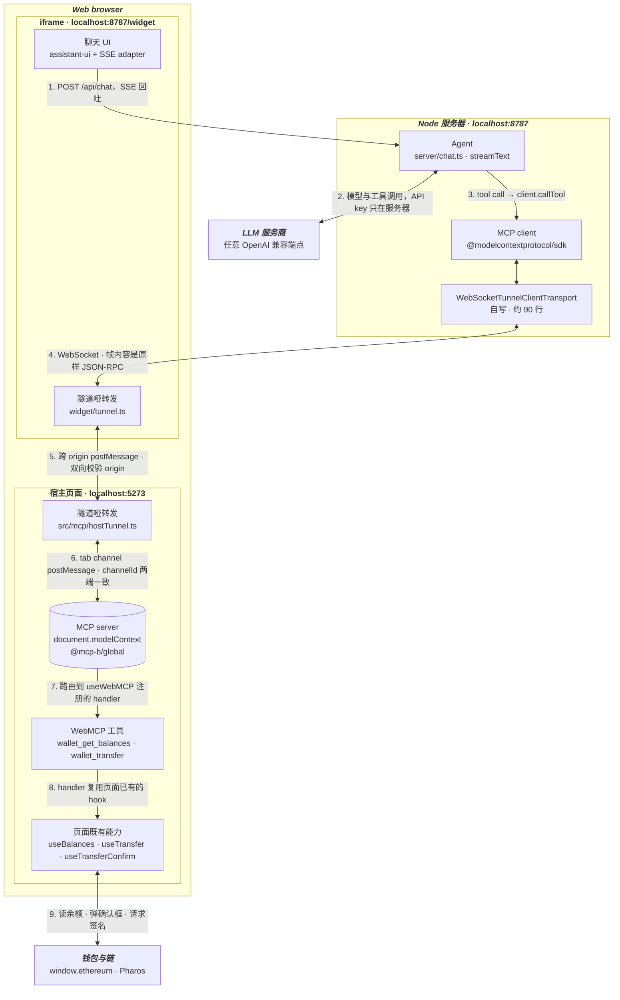
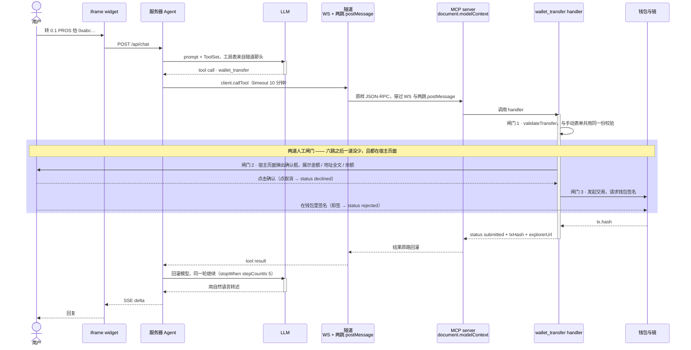

# WebMCP Wallet Demo

一个最小示例：**把 web3 页面已有的功能，通过 WebMCP 注入给跑在服务器端的 AI agent**。

页面本身有一套普通 UI（连钱包 / 余额卡片 / 转账表单）。WebMCP 做的事情只是把其中两个已有能力——**查余额**、**转账**——注册成 MCP 工具，让服务器端的 agent 可以发现并调用它们。**没有为 AI 重写一套业务逻辑**，工具 handler 直接复用页面自己在用的那几个 hook。

```bash
cp .env.example .env   # 至少填 LLM_API_KEY
pnpm install && pnpm dev   # 同时起宿主页面(5273) 与 widget+agent 服务器(8787)
```

---

## 1. 依赖包：@mcp-b/* 各管什么

WebMCP 的实现来自 [MCP-B](https://github.com/WebMCP-org/npm-packages) 的三个包，加上官方 MCP SDK。它们的分工是本 demo 最需要先搞清楚的一件事：

| 包 | 角色 | 在本 demo 的用法 |
|---|---|---|
| `@mcp-b/global` | **MCP server 端**。在页面里装一个 `document.modelContext` 运行时，并按配置起一个 tab transport 的 server | `index.html` 内联脚本配置 + `src/main.tsx` 兜底调用 `initializeWebModelContext()` |
| `@mcp-b/react-webmcp` | **React 绑定**。只剩 `useWebMCP()` 注册工具（server 侧）；`McpClientProvider` / `useMcpClient` 已不再使用——页面里已经没有 client 了 | `src/mcp/useWalletWebMcpTools.ts` |
| `@mcp-b/transports` | 不再直接使用其 transport 类。只**复用它的 postMessage 信封格式**（`src/mcp/tunnelEnvelope.ts`）——server 端的 transport 是自己写的 | `src/mcp/tunnelEnvelope.ts` 参照其源码逐字对齐 |
| 自写隧道 | 三段自写代码，把上面的 server 端接到跑在服务器进程里的 MCP client | `src/mcp/hostTunnel.ts`（宿主页面侧转发）/ `widget/tunnel.ts`（iframe 侧转发）/ `server/WebSocketTunnelClientTransport.ts`（服务器端 transport） |
| `@modelcontextprotocol/sdk` | 官方 MCP 协议实现，上面的 client/server 都是它的实例 | server 端 `Client`；页面端由 `@mcp-b/global` 内部使用 |

关键认知：**server 在页面里，client 在服务器上**。页面仍然是暴露能力的一方（MCP server，`document.modelContext`），但消费能力的一方（MCP client）搬到了 Node 进程里。两者之间隔着三跳：tab channel 的 postMessage、跨 origin 的 postMessage、WebSocket。这三跳传的都是**原样的 JSON-RPC**，所以 MCP 的语义一点没丢。

---

## 2. 页面 WebMCP 与服务器 agent 怎么建立连接

整体形状（图的画法参考 [webmachinelearning/webmcp](https://github.com/webmachinelearning/webmcp) 的 *WebMCP In-browser tool flow*，但那张图里的 agent 是**浏览器内置**的；本 demo 的 agent 是**跑在 Node 服务器进程里**的，中间要经过 iframe 与 WebSocket 才能碰到页面里的 MCP server）：



四个要点：

1. **两个哑转发器都不理解 MCP**，只搬 payload，所以控制字符串（`mcp-check-ready` / `mcp-server-ready` / `mcp-server-stopped`）与 JSON-RPC 一视同仁。这是隧道能保住全部 MCP 语义的原因——通知、progress、`tools/list_changed` 都不需要额外处理。
2. **握手**：宿主页面的 `TabServerTransport` 只在 `start()` 时广播一次 ready，那时 WS 多半还没连上；好在 v4 每收到一次 `mcp-check-ready` 都会补发 ready，所以服务器端主动问一次即可（`WebSocketTunnelClientTransport.start()` 里的 `this._send(CHECK_READY)`），谁先启动都能握上手。
3. **信封格式必须以实际安装的 v4 为准**（`src/mcp/tunnelEnvelope.ts`）。v4 是内联属性检查、没有 `isMcpMessage` / `postMcpMessage` 导出（那是 v5 的），格式对不上的症状是静默丢消息、不报错。所以格式集中在这一份文件里，并用测试钉死。
4. **工具调用超时必须显式传**：`client.callTool` 默认 60s，而 `wallet_transfer` 要等用户点确认 + 签名，本项目在 `server/mcpToolsToAiTools.ts` 里设为 10 分钟（`TOOL_CALL_TIMEOUT_MS`）。

---

## 3. 两个页面功能怎么注册成工具

**这一节的代码在本次改造中一行没动。** agent 从页内搬到服务器、中间加了 iframe 与 WebSocket 两跳，而工具注册处完全不受影响——这正是 MCP 这层抽象的价值：工具提供方不需要知道消费方在哪。

全部在 `src/mcp/useWalletWebMcpTools.ts`——**这是理解本 demo 的入口文件**。

注册用 `useWebMCP(definition, deps)`，形状类似 `useMemo`：

```ts
useWebMCP({ name, description, inputSchema, outputSchema, annotations, handler }, deps)
```

`App.tsx` 里把页面已有的状态与动作原封不动传进去，工具和手动 UI 共用同一份状态：

```tsx
function Page() {
  const { address, chainId, isCorrectChain } = useWallet();
  const balances = useBalances();
  const transfer  = useTransfer();
  const confirm   = useTransferConfirm();

  useWalletWebMcpTools({
    address, chainId, isCorrectChain,
    prosBalance: balances.pros.balance,
    usdcBalance: balances.usdc.balance,
    transfer: transfer.transfer,
    lastTransferError: transfer.lastError,
    requestConfirm: confirm.requestConfirm,   // 同一个确认弹窗，手动表单也在用
    refreshBalances: balances.refresh,
  });
  // ... 下面是普通 UI：<BalanceCards/> <TransferForm/> <TransferConfirmDialog/> <AgentWidget/>
}
```

### 工具 1：`wallet_get_balances`（只读）

```ts
useWebMCP(
  {
    name: 'wallet_get_balances',
    description:
      "Get the connected wallet's balances on Pharos: native PROS and USDC. Takes no arguments — it always reads the currently connected wallet, and cannot query an arbitrary address.",
    inputSchema: {},                                    // 无入参
    annotations: { title: 'Get wallet balances', readOnlyHint: true },
    outputSchema: { type: 'object', properties: { /* connected / address / chainId / pros / usdc ... */ }, required: ['connected'] },
    handler: () => {
      if (!address) return { connected: false as const };
      return {
        connected: true as const,
        address, chainId, chainName: CHAIN_NAME, correctChain: isCorrectChain,
        pros: { symbol: TOKENS.PROS.symbol, balance: prosBalance ?? undefined },
        usdc: { symbol: TOKENS.USDC.symbol, balance: usdcBalance ?? undefined, address: TOKENS.USDC.address },
      };
    },
  },
  [address, chainId, isCorrectChain, prosBalance, usdcBalance]   // handler 闭包读到的所有值
);
```

三个设计点：

- **`inputSchema: {}` 是故意的**——工具不接受地址参数，永远只读当前连接的钱包，防止模型代查别人的地址。
- **handler 不发请求**，只是把页面已经渲染出来的余额（`useBalances` 的 state）整理成结构化输出。AI 看到的数值和卡片上的数值必然一致。
- **`deps` 一定要写全**：handler 闭包里读到的每个值都得进数组，否则工具会拿到陈旧闭包里的旧余额。

### 工具 2：`wallet_transfer`（写，有副作用）

入参 `{ token: 'PROS'|'USDC', to: string, amount: string }`，`annotations: { readOnlyHint: false, destructiveHint: true }`。

handler 是一串顺序闸门，返回值用 `status` 区分五种结局：

```ts
handler: async ({ token, to, amount }) => {
  const toAddress = String(to ?? '').trim();
  const amountText = String(amount ?? '').trim();

  // 闸门 1：本地校验 —— 直接复用手动表单在用的那份 validateTransfer，不重写
  const v = validateTransfer(
    { token: key, to: toAddress, amount: amountText },
    { connected: Boolean(address), isCorrectChain, balance }
  );
  if (!v.ok) return { status: v.status, /* failed 或 blocked */ ...  };

  // 闸门 2：人工确认弹窗（和手动转账同一个弹窗）
  const confirmed = await requestConfirm({ token: key, symbol: meta.symbol, amount: amountText, to: toAddress, balance });
  if (!confirmed) return { status: 'declined', message: '用户在确认框里取消了这笔转账。除非用户再次要求，不要重试。' };

  // 闸门 3：钱包签名
  const txHash = await transfer({ token: key, to: toAddress, amount: amountText });
  if (!txHash) return { status: 'rejected', message: lastTransferError ?? '转账没有完成：用户拒签或交易失败。' };

  refreshBalances();
  return { status: 'submitted', txHash, explorerUrl: txUrl(txHash), message: `已发出 ...（只等交易发出，不等上链确认）` };
}
```

| status | 含义 |
|---|---|
| `submitted` | 交易已发出（拿到 `tx.hash`），**不代表已上链确认** |
| `declined` | 用户在确认弹窗点了取消——message 明确告诉模型不要重试 |
| `rejected` | 用户在钱包拒签，或交易发送失败 |
| `blocked` | 当前前提不允许（例如链不对），换条件可重试 |
| `failed` | 本地校验没过（未连接 / 地址非法 / 金额非法 / 余额不足）|

三个设计点：

- **模型无法跳过闸门 2 和 3**。工具能做的最坏情况是"诱导用户签一笔他本不想签的交易"，而这一步会被确认弹窗（展示金额 / 地址全文 / 余额）和钱包签名各拦一次。
- **校验逻辑只有一份**：`validateTransfer` 由手动表单和工具 handler 共用，不存在"UI 拦住了但工具没拦住"的缝。
- **状态语义写进 description / message 里给模型看**。比如 `declined` 的 message 直接写"不要重试"，`submitted` 的 message 提醒余额刷新可能还是转账前的数——模型的行为靠这些文案约束，而不是靠调用方额外写胶水代码。

---

### 一次 `wallet_transfer` 的完整时序

把第 2 节的六跳连接链路和上面的两道闸门串起来看：



只读的 `wallet_get_balances` 是同一条链路去掉中间那个高亮区——没有人工闸门，handler 同步返回页面已有的 state。

---

## 4. 接到你自己的页面

1. **页面侧**：复制 `index.html` 的内联脚本（`channelId` 改成你自己的），照 `src/mcp/useWalletWebMcpTools.ts` 用 `useWebMCP()` 包装页面**已有**的能力，`deps` 写全。
2. **嵌 widget**：复制 `src/mcp/tunnelEnvelope.ts` 与 `src/mcp/hostTunnel.ts`，照 `src/components/AgentWidget.tsx` 挂 iframe 并启动转发器。`widgetOrigin` 填 agent 服务商给你的 origin。
3. **widget 侧**（如果 widget 也是你自己的）：复制 `widget/tunnel.ts`，连上 WS 之后立刻装转发器。
4. **服务器侧**：复制 `server/WebSocketTunnelClientTransport.ts` 与 `server/sessions.ts`，每个 WS 连接建一个 `Client`，`callTool` 记得传够长的 `timeout`。

## 5. 三条必须知道的安全边界

1. **工具对同 tab 的其它 MCP 客户端可见，做不到"只对这个 agent 开放"**。工具注册在 `document.modelContext` 上并通过 tab transport 广播，同 tab 内任何连上这个 channel 的客户端（包括 MCP-B 浏览器扩展）都能 list/call。缓解手段是 `allowedOrigins` 限制到本 origin + 写操作强制人工闸门。要严格隔离就得放弃 mcp-b、自己实现内存工具注册表——本 demo 不做。

2. **跨 origin 的 postMessage 靠双向 origin 校验，这是隧道唯一的来源保证**。宿主侧只接受 `event.origin === WIDGET_ORIGIN` 且 `event.source === iframe.contentWindow` 的消息；widget 侧只接受 `event.origin === HOST_ORIGIN` 的消息。任何一侧写成 `'*'` 都会让页面上任意脚本能往隧道里灌 JSON-RPC。

3. **本实验没有做 WebSocket 鉴权，云端部署前必须补上**。现在服务器绑 `127.0.0.1`，WS 层只校验 `Origin` 头——这挡得住浏览器里的跨站请求，挡不住任何非浏览器客户端。云端部署必须改成：宿主页面向你的后端换取一个短期会话令牌，widget 建立 WS 时带上，服务器验签后才建 session。否则任何人都能连上你的 relay 并驱动别人页面上的工具。

## 6. 为什么不用 MCP-B 现成的方案

MCP-B（[WebMCP-org/npm-packages](https://github.com/WebMCP-org/npm-packages)）已经有 iframe transport 和一个 relay，但都不适配这个场景。

1. **`IframeParentTransport` / `IframeChildTransport` 方向是反的**。MCP-B 设想的 iframe 场景是「iframe 提供工具、宿主消费」（`<mcp-iframe>` 自定义元素就是把子页面的工具加前缀挂到父页面上）。我们要的是反过来：宿主提供工具、iframe 消费。

2. **`@mcp-b/global` 的 transport 选择写死了**。`createTransport()` 里 `window.parent !== window` 就用 iframe transport、否则用 tab transport，二选一；而且内部的 server 实例是模块级私有的，SDK 的 `Server` 一个实例又只能 connect 一个 transport。想让宿主页面「再挂一个面向 iframe 的 server transport」，绕不开 fork。

3. **`webmcp-local-relay` 形状对但代价不对**。它的架构确实是「页面 → 隐藏 iframe → WebSocket → 服务器 MCP」，但面向 localhost + stdio（端口扫描发现、server/client 双模式），而且**不传 MCP 协议**——它用一套自定义信封（`hello` / `tools/list` / `invoke` / `result`）在服务器端**重建**一个 MCP server，代价是丢掉通知、progress、`tools/list_changed` 这些原生语义，还要维护两套 schema。而云端真正需要的会话鉴权，它反而没有。

4. **所以我们打隧道，不重建**。MCP 的 `Transport` 接口只有 6 个成员（`start` / `send` / `close` + 三个回调），所以两端哑转发原样的 JSON-RPC、服务器端自写一个 transport 交给官方 `Client` 就够了——约 180 行新代码，协议保真度反而比方案 3 更高。

完整的调研与取舍见 `docs/superpowers/specs/2026-08-27-webmcp-server-agent-tunnel-design.md`。

---

## 已验证 / 待验证

**代码级已验证**：`pnpm test` 跑 57 个测试、覆盖 8 个文件，其中 `server/tunnel.integration.test.ts` 用真实的转发器函数拼出完整三跳链路（并做过故障注入，证明这个测试确实能测出坏情况，不是摆设）；`pnpm exec tsc -b` 与 `pnpm build` 均通过；服务器可以正常启动，`GET http://localhost:8787/widget` 返回 200；SSE 事件契约在 `server/index.ts`（发送端）与 `widget/sseChatAdapter.ts`（接收端）两侧手动核对过一致。

**还没有跑过的是完整浏览器链路**——本仓库这次没有条件起浏览器、连钱包、配 LLM key 去实际跑一遍。按上面的 quickstart 起完 `pnpm dev` 之后，建议自己确认这三件事：

1. 打开 `http://localhost:5273`，服务器进程的终端日志应该打印出 `session ... 就绪，页面提供 2 个工具：wallet_get_balances, wallet_transfer`（`server/index.ts` 里 `registry.create(...).then(...)` 那行）。
2. 在右下角的 widget 里问 agent 余额，应该能拿到与页面卡片一致的数字。
3. 发起一笔小额转账：**确认弹窗必须出现在宿主页面（`localhost:5273`）上，而不是 iframe 里**——这是「两道人工闸门都在宿主页面」这条设计的可观察验证点。
