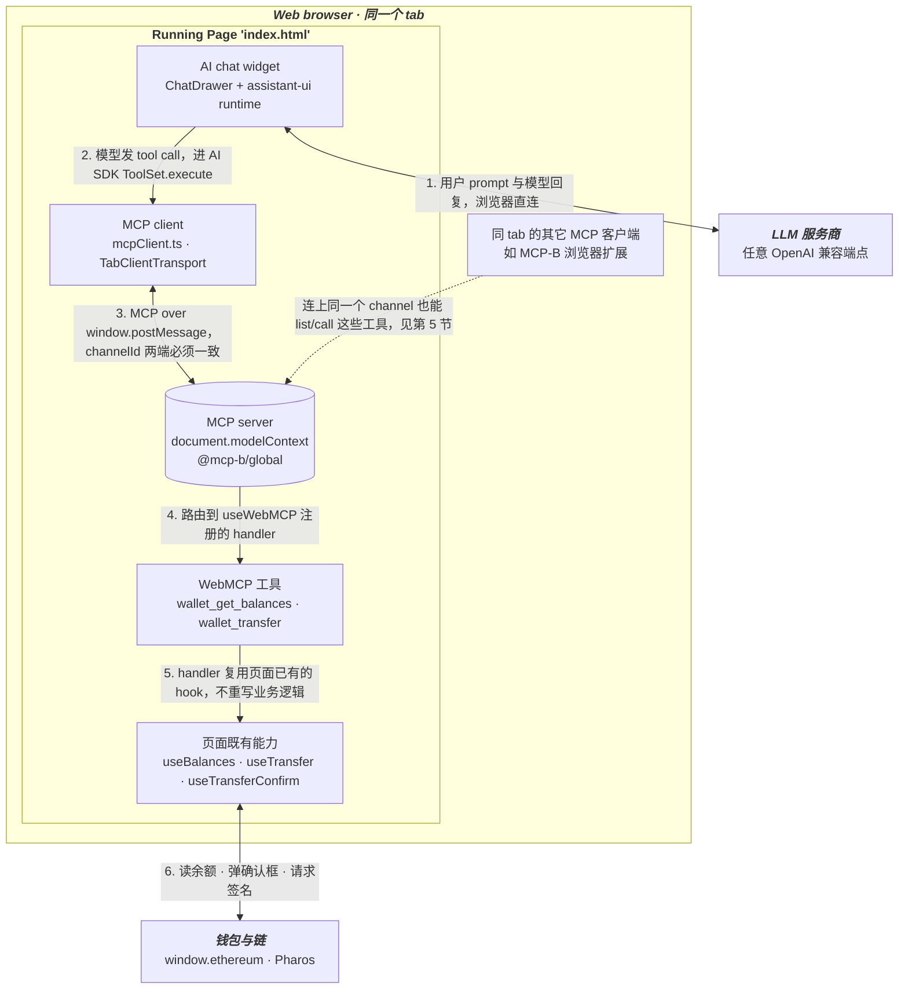
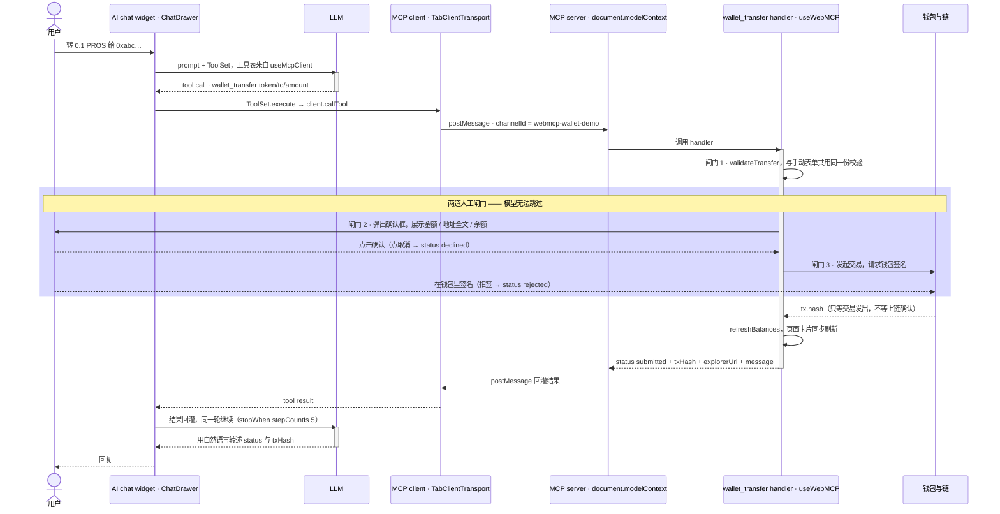

# WebMCP Wallet Demo

一个最小示例：**把 web3 页面已有的功能，通过 WebMCP 注入给页内的 AI chat widget**。

页面本身有一套普通 UI（连钱包 / 余额卡片 / 转账表单）。WebMCP 做的事情只是把其中两个已有能力——**查余额**、**转账**——注册成 MCP 工具，让 chat widget 里的模型可以发现并调用它们。**没有为 AI 重写一套业务逻辑**，工具 handler 直接复用页面自己在用的那几个 hook。

```bash
cp .env.example .env   # 至少填 VITE_LLM_API_KEY
pnpm install && pnpm dev
```

---

## 1. 依赖包：@mcp-b/* 各管什么

WebMCP 的实现来自 [MCP-B](https://github.com/MiguelsPizza/WebMCP) 的三个包，加上官方 MCP SDK。它们的分工是本 demo 最需要先搞清楚的一件事：

| 包 | 角色 | 在本 demo 的用法 |
|---|---|---|
| `@mcp-b/global` | **MCP server 端**。在页面里装一个 `document.modelContext` 运行时，并按配置起一个 tab transport 的 server | `index.html` 内联脚本配置 + `src/main.tsx` 兜底调用 `initializeWebModelContext()` |
| `@mcp-b/react-webmcp` | **React 绑定**。`useWebMCP()` 注册工具（server 侧）；`<McpClientProvider>` / `useMcpClient()` 管理客户端连接与工具列表（client 侧） | `src/mcp/useWalletWebMcpTools.ts`、`src/App.tsx`、`src/components/aiChat/ChatDrawer.tsx` |
| `@mcp-b/transports` | **传输层**。`TabClientTransport` 走 `window.postMessage`，让同一个 tab 内的 client 连上 server | `src/mcp/mcpClient.ts` |
| `@modelcontextprotocol/sdk` | 官方 MCP 协议实现，上面三个包的底座。这里只直接用到 `Client` | `src/mcp/mcpClient.ts` |

关键认知：**server 和 client 都在同一个页面里**。页面既是"暴露能力的一方"（server），又是"消费能力的一方"（client，因为 chat widget 也在这个页面）。两者不共享内存，而是通过 postMessage 上的 MCP 协议对话——正因为如此，同 tab 的浏览器扩展（如 MCP-B extension）也能连上同一个 channel。

---

## 2. 页面 WebMCP 与 AI chat widget 怎么建立连接

整体形状（图的画法参考 [webmachinelearning/webmcp](https://github.com/webmachinelearning/webmcp) 的 *WebMCP In-browser tool flow*，但那张图里的 agent 是**浏览器内置**的；本 demo 的 agent 是**页面自带的 chat widget**，所以 MCP server 和 client 都在同一个页面里，靠 `postMessage` 对话）：



搭建这条链路是四步。

### ① + ② server 端：channelId 必须在 import 之前设好

`index.html`：

```html
<script>
  window.__webModelContextOptions = {
    transport: {
      tabServer: {
        allowedOrigins: [location.origin],
        channelId: 'webmcp-wallet-demo',
      },
    },
  };
</script>
<script type="module" src="/src/main.tsx"></script>
```

**为什么必须写在 `index.html` 而不能挪进 `main.tsx`**：`@mcp-b/global` 在被 import 的那一刻就会读取这个全局变量并自动初始化（模块顶层副作用），而 ESM import 先于同模块的后续代码执行——也就是说它跑在 `main.tsx` 里那句显式 `initializeWebModelContext()` 之前。而 `initializeWebModelContext` 内部是 `if (runtime) return`，谁先跑谁生效。如果不在这里提前设置，server 会被钉死在默认的 `mcp-default` 通道上。

`main.tsx` 里那次调用只是兜底（换了别的 HTML 入口时才真正生效）。

### ③ client 端：单例 + 同一个 channelId

`src/mcp/mcpClient.ts` 导出两个单例 getter：

```ts
export const MCP_CHANNEL_ID = 'webmcp-wallet-demo';  // ⚠️ 必须与 index.html 完全一致

// 请求超时放到 10 分钟：wallet_transfer 要等用户点确认框 + 钱包签名
const REQUEST_TIMEOUT_MS = 10 * 60 * 1000;

getMcpClient()     // new Client({ name, version })，模块级单例
getMcpTransport()  // new TabClientTransport({ targetOrigin, channelId, requestTimeout })
```

**必须是模块级单例**：React 重渲染时若重建 client/transport，会反复建连断连。

`src/App.tsx` 把它们交给 provider：

```tsx
<WalletProvider>
  <McpClientProvider client={getMcpClient()} transport={getMcpTransport()} opts={{}}>
    <Page />
  </McpClientProvider>
</WalletProvider>
```

### ④ chat widget 侧：把 MCP 工具转成 AI SDK 的 ToolSet

`ChatDrawer.tsx`：

```tsx
const { client, tools, isConnected } = useMcpClient();

const toolSet = useMemo<ToolSet>(
  () => (isConnected ? mcpToolsToAiTools(tools, client) : {}),
  [tools, client, isConnected]
);

// adapter 只能创建一次，否则会重建 runtime、丢掉聊天记录
// → 工具表不进依赖数组，用 ref 转交
const toolSetRef = useRef(toolSet);
useEffect(() => { toolSetRef.current = toolSet; }, [toolSet]);
const adapter = useMemo(() => createChatAdapter(() => toolSetRef.current), []);
const runtime = useLocalRuntime(adapter);
```

`src/mcp/mcpTools.ts` 做的转换很薄——把每个 MCP 工具的 JSON Schema 包成 AI SDK 的 tool，`execute` 里回调 `client.callTool()`：

```ts
set[t.name] = {
  description: t.description ?? '',
  inputSchema: jsonSchema(t.inputSchema ?? { type: 'object', properties: {} }),
  execute: async (args) => {
    try {
      const res = await client.callTool({ name: t.name, arguments: args ?? {} });
      return res.structuredContent ?? textOf(res.content) ?? {};
    } catch (e) {
      return { error: e instanceof Error ? e.message : String(e) };  // 不抛，避免打断整轮对话
    }
  },
};
```

之后就是普通的 AI SDK tool-calling 循环（`src/ai/chatModel.ts`，`streamText` + `stopWhen: stepCountIs(5)`）：模型发 tool call → `execute` → `client.callTool` → postMessage 回到 server → `useWebMCP` 的 handler → 结果原路回灌 → 模型继续说话。

### 两个踩坑点

1. **channelId 不同步** → client 永远连不上 server，只会在 `requestTimeout` 超时后收到 MCP `-32001`。改一处必须同步改另一处（`index.html` ↔ `MCP_CHANNEL_ID`）。
2. **React 19 StrictMode 下 `Already connected to a transport`**：`<McpClientProvider>` 的 connect effect 会 mount→cleanup→mount 两次，cleanup 时它只重置自己的 ref、从不调 `client.close()`，于是第二次 mount 在同一个 client 上再 connect 一次，SDK 的 `Protocol.connect()` 同步抛错。本 demo 的解法是在 `mcpClient.ts` 里给 `client.connect` 包一层幂等（同一个 transport 的重复调用复用第一次的 promise，换 transport 或真实失败照常抛）——不改 node_modules、不关 StrictMode。

不想打开 chat 也能验证连接，看 `src/components/McpStatus.tsx`：`useMcpClient()` 直接给出连接状态与工具名列表。

---

## 3. 两个页面功能怎么注册成工具

全部在 `src/mcp/useWalletWebMcpTools.ts`——**这是理解本 demo 的入口文件**。

注册用 `useWebMCP(definition, deps)`，形状类似 `useMemo`：

```ts
useWebMCP({ name, description, inputSchema, outputSchema, annotations, handler }, deps)
```

`App.tsx` 里把页面已有的状态与动作原封不动传进去，工具和手动 UI 共用同一份状态：

```tsx
function Page() {
  const { address, chainId, isCorrectChain } = useWallet();
  const balances = useBalances();
  const transfer  = useTransfer();
  const confirm   = useTransferConfirm();

  useWalletWebMcpTools({
    address, chainId, isCorrectChain,
    prosBalance: balances.pros.balance,
    usdcBalance: balances.usdc.balance,
    transfer: transfer.transfer,
    lastTransferError: transfer.lastError,
    requestConfirm: confirm.requestConfirm,   // 同一个确认弹窗，手动表单也在用
    refreshBalances: balances.refresh,
  });
  // ... 下面是普通 UI：<BalanceCards/> <TransferForm/> <TransferConfirmDialog/> <ChatLauncher/>
}
```

### 工具 1：`wallet_get_balances`（只读）

```ts
useWebMCP(
  {
    name: 'wallet_get_balances',
    description:
      "Get the connected wallet's balances on Pharos: native PROS and USDC. Takes no arguments — it always reads the currently connected wallet, and cannot query an arbitrary address.",
    inputSchema: {},                                    // 无入参
    annotations: { title: 'Get wallet balances', readOnlyHint: true },
    outputSchema: { type: 'object', properties: { /* connected / address / chainId / pros / usdc ... */ }, required: ['connected'] },
    handler: () => {
      if (!address) return { connected: false as const };
      return {
        connected: true as const,
        address, chainId, chainName: CHAIN_NAME, correctChain: isCorrectChain,
        pros: { symbol: TOKENS.PROS.symbol, balance: prosBalance ?? undefined },
        usdc: { symbol: TOKENS.USDC.symbol, balance: usdcBalance ?? undefined, address: TOKENS.USDC.address },
      };
    },
  },
  [address, chainId, isCorrectChain, prosBalance, usdcBalance]   // handler 闭包读到的所有值
);
```

三个设计点：

- **`inputSchema: {}` 是故意的**——工具不接受地址参数，永远只读当前连接的钱包，防止模型代查别人的地址。
- **handler 不发请求**，只是把页面已经渲染出来的余额（`useBalances` 的 state）整理成结构化输出。AI 看到的数值和卡片上的数值必然一致。
- **`deps` 一定要写全**：handler 闭包里读到的每个值都得进数组，否则工具会拿到陈旧闭包里的旧余额。

### 工具 2：`wallet_transfer`（写，有副作用）

入参 `{ token: 'PROS'|'USDC', to: string, amount: string }`，`annotations: { readOnlyHint: false, destructiveHint: true }`。

handler 是一串顺序闸门，返回值用 `status` 区分五种结局：

```ts
handler: async ({ token, to, amount }) => {
  const toAddress = String(to ?? '').trim();
  const amountText = String(amount ?? '').trim();

  // 闸门 1：本地校验 —— 直接复用手动表单在用的那份 validateTransfer，不重写
  const v = validateTransfer(
    { token: key, to: toAddress, amount: amountText },
    { connected: Boolean(address), isCorrectChain, balance }
  );
  if (!v.ok) return { status: v.status, /* failed 或 blocked */ ...  };

  // 闸门 2：人工确认弹窗（和手动转账同一个弹窗）
  const confirmed = await requestConfirm({ token: key, symbol: meta.symbol, amount: amountText, to: toAddress, balance });
  if (!confirmed) return { status: 'declined', message: '用户在确认框里取消了这笔转账。除非用户再次要求，不要重试。' };

  // 闸门 3：钱包签名
  const txHash = await transfer({ token: key, to: toAddress, amount: amountText });
  if (!txHash) return { status: 'rejected', message: lastTransferError ?? '转账没有完成：用户拒签或交易失败。' };

  refreshBalances();
  return { status: 'submitted', txHash, explorerUrl: txUrl(txHash), message: `已发出 ...（只等交易发出，不等上链确认）` };
}
```

| status | 含义 |
|---|---|
| `submitted` | 交易已发出（拿到 `tx.hash`），**不代表已上链确认** |
| `declined` | 用户在确认弹窗点了取消——message 明确告诉模型不要重试 |
| `rejected` | 用户在钱包拒签，或交易发送失败 |
| `blocked` | 当前前提不允许（例如链不对），换条件可重试 |
| `failed` | 本地校验没过（未连接 / 地址非法 / 金额非法 / 余额不足）|

三个设计点：

- **模型无法跳过闸门 2 和 3**。工具能做的最坏情况是"诱导用户签一笔他本不想签的交易"，而这一步会被确认弹窗（展示金额 / 地址全文 / 余额）和钱包签名各拦一次。
- **校验逻辑只有一份**：`validateTransfer` 由手动表单和工具 handler 共用，不存在"UI 拦住了但工具没拦住"的缝。
- **状态语义写进 description / message 里给模型看**。比如 `declined` 的 message 直接写"不要重试"，`submitted` 的 message 提醒余额刷新可能还是转账前的数——模型的行为靠这些文案约束，而不是靠调用方额外写胶水代码。

---

### 一次 `wallet_transfer` 的完整时序

把第 2 节的连接链路和上面的两道闸门串起来看（画法参考规范仓库 `docs/service-workers.md` 里的时序图）：



只读的 `wallet_get_balances` 是同一条链路去掉中间那个高亮区——没有人工闸门，handler 同步返回页面已有的 state。

---

## 4. 接到你自己的页面

1. 复制 `index.html` 的内联脚本，把 `channelId` 改成你自己的名字（必须在 `@mcp-b/global` 被 import 之前执行）。
2. 复制 `src/mcp/mcpClient.ts`，`MCP_CHANNEL_ID` 与上一步**完全一致**；若有需要用户交互的慢工具，把 `requestTimeout` 放大。
3. 参照 `src/mcp/useWalletWebMcpTools.ts` 写自己的 `useXxxWebMcpTools`，用 `useWebMCP()` 包装页面**已有**的能力，`deps` 写全。
4. `<McpClientProvider>` 包在需要工具的组件外层，然后把 chat widget（`<ChatLauncher/>` + `<ChatDrawer/>`，或你自己的 UI）挂进页面。

## 5. 两条必须知道的安全边界

1. **工具对同 tab 的浏览器扩展可见，做不到"只对页内 chat 开放"**。工具注册在 `document.modelContext` 上并通过 tab transport 广播，同 tab 内任何连上这个 channel 的 MCP 客户端（包括 MCP-B 扩展）都能 list/call。缓解手段就是 `allowedOrigins` 限制到本 origin + 写操作强制人工闸门。要严格隔离就得放弃 mcp-b、自己实现内存工具注册表——本 demo 不做。
2. **`VITE_LLM_API_KEY` 会被打进前端产物**，任何人可从 bundle 提取。仅限本地 / 内网 demo；生产必须改后端代理。
