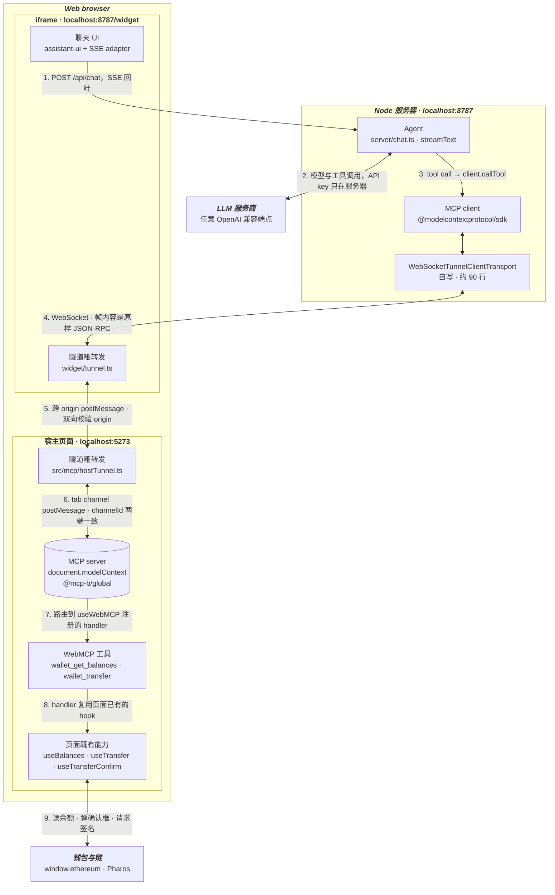
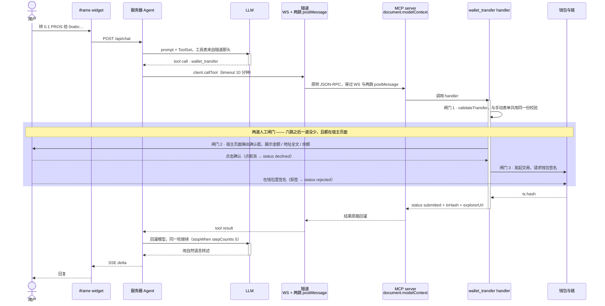

# 服务器端 Agent 接入页面 WebMCP 工具 —— 实施计划

> **For agentic workers:** REQUIRED SUB-SKILL: Use superpowers:subagent-driven-development (recommended) or superpowers:executing-plans to implement this plan task-by-task. Steps use checkbox (`- [ ]`) syntax for tracking.

**Goal:** 把 AI agent 从宿主页面搬到服务器端，让它经由一个跨 origin 的 iframe widget，仍能调用宿主页面注册的 WebMCP 工具。

**Architecture:** 方案 A —— 两跳哑转发 + JSON-RPC 原样打隧道。宿主页面与 iframe 都只转发字节、不理解 MCP；服务器端自写一个 WebSocket transport 交给官方 SDK 的 `Client`，从而免费拿到完整 MCP 语义。

**Tech Stack:** TypeScript / React 19 / Vite 7（middleware mode）/ Node 22 / `ws` / `@modelcontextprotocol/sdk` 1.29.0 / `@mcp-b/global` 4.0.0 / AI SDK `ai` v7 / assistant-ui / vitest

**Spec:** `docs/superpowers/specs/2026-08-27-webmcp-server-agent-tunnel-design.md`

---

## Global Constraints

这些约束适用于**每一个** task，不再在单个 task 里重复。

**C1. 版本以实际安装的 v4 为准，不以 `references/` 的 v5 为准。**
`references/npm-packages-main` 是 MCP-B **5.0.1**，项目锁的是 **4.0.0**。二者 API 与实现均有差异。写代码时**只**参照 `node_modules/@mcp-b/transports/dist/index.d.ts`。照 references 写而实际版本不符，症状是静默丢消息、无报错。

**C2. v4 的 postMessage 信封格式（已从 dist 逐字确认）：**

```ts
{ channel: string, type: 'mcp', direction: 'client-to-server' | 'server-to-client', payload: unknown }
```

判定条件（v4 是内联的属性检查，**没有** `isMcpMessage` / `postMcpMessage` 这两个导出函数——那是 v5 才有的）：

```ts
e.data?.channel === channelId && e.data?.type === 'mcp' && e.data?.direction === '<方向>'
```

`payload` 有两类，隧道必须**原样透传两类**：
- JSON-RPC 消息（对象）
- 三个控制字符串：`'mcp-check-ready'`（client→server）、`'mcp-server-ready'`、`'mcp-server-stopped'`（server→client）

**C3. v4 `TabServerTransport` 的两个已确认行为（决定了握手与超时的设计）：**

1. **`start()` 广播一次 ready，且每次收到 `'mcp-check-ready'` 都会补发一次 `'mcp-server-ready'`。** 所以服务器端主动发 check-ready 一定能拿到 ready，无论谁先启动。
2. **它对每个 in-flight 请求挂了 `beforeunload` 钩子**：宿主页面刷新/跳转时，会给所有未完成请求回一个 `result`（`content: [{type:'text', text:'Tool execution interrupted by page navigation'}]`，`metadata.navigationInterrupted: true`），**而不是**报错。它还有个 `REQUEST_TIMEOUT_MS = 300000`（5 分钟）的 stale 清理，但那只清内部 map、不回消息。

**C4. 工具调用超时必须 ≥ 10 分钟。** `wallet_transfer` 要等用户点确认弹窗 + 钱包签名。服务器端 `client.callTool(...)` 必须显式传 `{ timeout: 600000 }`；SDK 默认是 60s，漏传的症状是「转账走到一半模型收到超时错误」。

**C5. 端口与 origin（全项目唯一真值，出现处必须一致）：**

| 常量 | 值 |
|---|---|
| 宿主页面 origin | `http://localhost:5273` |
| 服务器 / widget origin | `http://localhost:8787` |
| tab channel id | `webmcp-wallet-demo` |
| 隧道 channel id | `webmcp-tunnel` |

**C6. API key 只在服务器端。** `.env` 里用 `LLM_API_KEY`（**无** `VITE_` 前缀，否则会打进前端产物）。链相关的 `VITE_*` 变量保持不变。

**C7. 不做的事**（写进 README，但不实现）：WS 鉴权与会话令牌、多 tab 聚合、MCP resources/prompts、保留页内 chat 旧链路、生产构建配置。

**C8. 注释与文档一律中文**，与现有代码库一致。注释解释**为什么**，不复述代码在做什么。

---

## 文件结构

### 新建

| 文件 | 职责 |
|---|---|
| `src/mcp/tunnelEnvelope.ts` | 信封的构造与判定，浏览器两侧共用。**唯一**知道 C2 格式细节的前端文件 |
| `src/mcp/hostTunnel.ts` | 宿主侧哑转发：iframe ↔ tab channel |
| `src/components/AgentWidget.tsx` | 挂 iframe、调用 `startHostTunnel`、渲染隧道状态 |
| `server/tunnelProtocol.ts` | 服务器侧信封判定 + 控制字符串常量（Node 端，不 import 浏览器代码） |
| `server/WebSocketTunnelClientTransport.ts` | MCP `Transport` 实现，`ws` ↔ JSON-RPC |
| `server/sessions.ts` | 一个 WS 连接 = 一个 session（transport + Client + tools） |
| `server/chat.ts` | `streamText` + SSE 响应；system prompt 与错误处理从 `src/ai/chatModel.ts` 搬来 |
| `server/index.ts` | http + ws + vite middleware，进程入口 |
| `server/mcpToolsToAiTools.ts` | 从 `src/mcp/mcpTools.ts` 搬来（Node 端，见 Task 6 说明） |
| `widget/index.html` | iframe 页面入口 |
| `widget/main.tsx` | iframe React 入口 |
| `widget/tunnel.ts` | iframe 侧哑转发：WS ↔ parent postMessage |
| `widget/WidgetChat.tsx` | 聊天面板（复用 `src/components/aiChat/*`） |
| `widget/sseChatAdapter.ts` | `ChatModelAdapter`，走 `POST /api/chat` 的 SSE |
| `server/tsconfig.json` | 服务器与 widget 的 TS 配置 |

### 修改

| 文件 | 改动 |
|---|---|
| `src/App.tsx` | 去掉 `McpClientProvider` 与 `ChatLauncher`，换成 `<AgentWidget />` |
| `src/components/McpStatus.tsx` | 不再用 `useMcpClient`，改为接收隧道状态 props |
| `package.json` | 新增 `ws`/`vitest` 等依赖与 `dev` 脚本 |
| `.env.example` | `VITE_LLM_API_KEY` → `LLM_API_KEY` |
| `README.md` | 按 spec §6 重写 |
| `tsconfig.json` | 增加 `server/tsconfig.json` 引用 |

### 删除

| 文件 | 原因 |
|---|---|
| `src/mcp/mcpClient.ts` | 页内 client 不再存在（spec §2「单会话取舍」） |
| `src/ai/chatModel.ts` | 搬到 `server/chat.ts` |
| `src/mcp/mcpTools.ts` | 搬到 `server/mcpToolsToAiTools.ts` |
| `src/components/aiChat/ChatDrawer.tsx` | 被 `widget/WidgetChat.tsx` 取代 |
| `src/components/aiChat/ChatLauncher.tsx` | iframe 自带开关 |

**保持不动**：`src/mcp/useWalletWebMcpTools.ts`、`src/chain/*`、`src/wallet/*`、`src/components/aiChat/{Thread,Composer,SamplePrompts}.tsx`、`src/theme.ts`、`index.html`。

---

## Task 1: 测试基建与信封模块

**Files:**
- Create: `src/mcp/tunnelEnvelope.ts`
- Create: `src/mcp/tunnelEnvelope.test.ts`
- Create: `vitest.config.ts`
- Modify: `package.json`

**Interfaces:**
- Consumes: 无（首个 task）
- Produces:
  ```ts
  export const TAB_CHANNEL_ID = 'webmcp-wallet-demo';
  export const TUNNEL_CHANNEL_ID = 'webmcp-tunnel';
  export const CHECK_READY = 'mcp-check-ready';
  export const SERVER_READY = 'mcp-server-ready';
  export const SERVER_STOPPED = 'mcp-server-stopped';
  export type Direction = 'client-to-server' | 'server-to-client';
  export interface McpEnvelope { channel: string; type: 'mcp'; direction: Direction; payload: unknown }
  export function makeEnvelope(channel: string, direction: Direction, payload: unknown): McpEnvelope;
  export function matchEnvelope(data: unknown, channel: string, direction: Direction): data is McpEnvelope;
  ```

- [ ] **Step 1: 装依赖**

```bash
pnpm add -D vitest@^3
pnpm add ws@^8.18.0
pnpm add -D @types/ws@^8.5.13 tsx@^4.19.2
```

- [ ] **Step 2: 写 vitest 配置**

创建 `vitest.config.ts`：

```ts
import path from 'node:path';
import { defineConfig } from 'vitest/config';

export default defineConfig({
  resolve: {
    alias: [{ find: '@', replacement: path.resolve(__dirname, './src') }],
  },
  test: {
    environment: 'node',
    include: ['src/**/*.test.ts', 'server/**/*.test.ts', 'widget/**/*.test.ts'],
  },
});
```

在 `package.json` 的 `scripts` 里加：

```json
"test": "vitest run",
"test:watch": "vitest"
```

- [ ] **Step 3: 写失败的测试**

创建 `src/mcp/tunnelEnvelope.test.ts`：

```ts
import { describe, it, expect } from 'vitest';
import { makeEnvelope, matchEnvelope, TAB_CHANNEL_ID } from './tunnelEnvelope';

describe('makeEnvelope', () => {
  it('产出 v4 TabServerTransport 认得的四个字段', () => {
    expect(makeEnvelope('ch', 'client-to-server', { jsonrpc: '2.0' })).toEqual({
      channel: 'ch',
      type: 'mcp',
      direction: 'client-to-server',
      payload: { jsonrpc: '2.0' },
    });
  });

  it('控制字符串原样放进 payload，不做包装', () => {
    expect(makeEnvelope('ch', 'client-to-server', 'mcp-check-ready').payload).toBe(
      'mcp-check-ready'
    );
  });
});

describe('matchEnvelope', () => {
  const ok = makeEnvelope(TAB_CHANNEL_ID, 'server-to-client', { a: 1 });

  it('四个字段全中才算匹配', () => {
    expect(matchEnvelope(ok, TAB_CHANNEL_ID, 'server-to-client')).toBe(true);
  });

  it('channel 不同 → 不匹配（这是隧道与 tab channel 不串台的唯一保证）', () => {
    expect(matchEnvelope(ok, 'other-channel', 'server-to-client')).toBe(false);
  });

  it('方向不同 → 不匹配（哑转发靠它避免把自己发的消息又收回来，形成回环）', () => {
    expect(matchEnvelope(ok, TAB_CHANNEL_ID, 'client-to-server')).toBe(false);
  });

  it('type 不是 mcp → 不匹配', () => {
    expect(matchEnvelope({ ...ok, type: 'other' }, TAB_CHANNEL_ID, 'server-to-client')).toBe(false);
  });

  it('null / 字符串 / undefined 不会抛异常', () => {
    expect(matchEnvelope(null, TAB_CHANNEL_ID, 'server-to-client')).toBe(false);
    expect(matchEnvelope('nope', TAB_CHANNEL_ID, 'server-to-client')).toBe(false);
    expect(matchEnvelope(undefined, TAB_CHANNEL_ID, 'server-to-client')).toBe(false);
  });

  it('payload 为 false / 0 / null 时仍算匹配（不能用真值判断 payload 是否存在）', () => {
    for (const p of [false, 0, null]) {
      expect(matchEnvelope(makeEnvelope('ch', 'client-to-server', p), 'ch', 'client-to-server')).toBe(
        true
      );
    }
  });
});
```

- [ ] **Step 4: 跑测试，确认失败**

Run: `pnpm test src/mcp/tunnelEnvelope.test.ts`
Expected: FAIL，报错找不到 `./tunnelEnvelope` 模块。

- [ ] **Step 5: 写实现**

创建 `src/mcp/tunnelEnvelope.ts`：

```ts
/**
 * postMessage 信封的构造与判定 —— 宿主侧与 iframe 侧共用这一份。
 *
 * 格式必须与实际安装的 @mcp-b/transports 4.0.0 逐字一致（见
 * node_modules/@mcp-b/transports/dist/index.js 里 TabServerTransport 的
 * _messageHandler）。v4 是内联的属性检查，没有导出 isMcpMessage/postMcpMessage
 * 这两个 helper —— 那是 v5 才有的，references/ 目录下的代码不能直接照抄。
 *
 * 格式对不上的症状是静默丢消息、不报错，所以这里集中一份、并用测试钉死。
 */

/** @mcp-b/global 的 tabServer channel，与 index.html 内联脚本里的配置必须一致 */
export const TAB_CHANNEL_ID = 'webmcp-wallet-demo';

/** 宿主 ↔ iframe 之间隧道自己的 channel，与 TAB_CHANNEL_ID 分开避免串台 */
export const TUNNEL_CHANNEL_ID = 'webmcp-tunnel';

/** v4 的三个控制字符串。它们与 JSON-RPC 消息共用 payload 字段，隧道必须原样透传 */
export const CHECK_READY = 'mcp-check-ready';
export const SERVER_READY = 'mcp-server-ready';
export const SERVER_STOPPED = 'mcp-server-stopped';

export type Direction = 'client-to-server' | 'server-to-client';

export interface McpEnvelope {
  channel: string;
  type: 'mcp';
  direction: Direction;
  payload: unknown;
}

export function makeEnvelope(
  channel: string,
  direction: Direction,
  payload: unknown
): McpEnvelope {
  return { channel, type: 'mcp', direction, payload };
}

export function matchEnvelope(
  data: unknown,
  channel: string,
  direction: Direction
): data is McpEnvelope {
  if (typeof data !== 'object' || data === null) return false;
  const d = data as Record<string, unknown>;
  // 只校验前三个字段：payload 可能合法地是 false / 0 / null，不能用真值判断它是否存在
  return d.channel === channel && d.type === 'mcp' && d.direction === direction;
}
```

- [ ] **Step 6: 跑测试，确认通过**

Run: `pnpm test src/mcp/tunnelEnvelope.test.ts`
Expected: PASS，10 个断言全绿。

- [ ] **Step 7: 提交**

```bash
git add package.json pnpm-lock.yaml vitest.config.ts src/mcp/tunnelEnvelope.ts src/mcp/tunnelEnvelope.test.ts
git commit -m "feat: 隧道信封模块与 vitest 基建

信封格式以实际安装的 @mcp-b/transports 4.0.0 为准（v4 无
isMcpMessage/postMcpMessage 导出，references/ 的 v5 不能照抄），
集中一份并用测试钉死。"
```

---

## Task 2: 服务器端 WebSocket transport

**Files:**
- Create: `server/tunnelProtocol.ts`
- Create: `server/WebSocketTunnelClientTransport.ts`
- Create: `server/WebSocketTunnelClientTransport.test.ts`
- Create: `server/tsconfig.json`
- Modify: `tsconfig.json`

**Interfaces:**
- Consumes: 无（Node 端独立，刻意不 import `src/`，见下方说明）
- Produces:
  ```ts
  // server/tunnelProtocol.ts
  export const CHECK_READY = 'mcp-check-ready';
  export const SERVER_READY = 'mcp-server-ready';
  export const SERVER_STOPPED = 'mcp-server-stopped';

  // server/WebSocketTunnelClientTransport.ts
  export interface WebSocketTunnelClientTransportOptions {
    send: (data: string) => void;   // 抽象掉 ws 实例，方便测试
    close: () => void;
    readyTimeoutMs?: number;        // 默认 15000
  }
  export class WebSocketTunnelClientTransport implements Transport {
    constructor(options: WebSocketTunnelClientTransportOptions);
    readonly serverReadyPromise: Promise<void>;
    handleIncoming(raw: string): void;   // 由 ws.on('message') 调用
    handleSocketClose(): void;           // 由 ws.on('close') 调用
    start(): Promise<void>;
    send(message: JSONRPCMessage): Promise<void>;
    close(): Promise<void>;
    onclose?: () => void;
    onerror?: (error: Error) => void;
    onmessage?: (message: JSONRPCMessage) => void;
  }
  ```

**为什么 `server/` 不 import `src/mcp/tunnelEnvelope.ts`**：服务器端只处理**裸 payload**——WS 帧里传的就是 payload 本身，信封是 iframe 那一侧加的。服务器不需要 `makeEnvelope`/`matchEnvelope`，只需要三个控制字符串。跨 tsconfig 引用一个用不上的浏览器模块会把 DOM 类型拖进 Node 编译单元，得不偿失。三个常量在两处各写一遍，用 Task 8 的集成测试保证它们一致。

- [ ] **Step 1: 建 server 的 tsconfig**

创建 `server/tsconfig.json`：

```json
{
  "compilerOptions": {
    "tsBuildInfoFile": "../node_modules/.tmp/tsconfig.server.tsbuildinfo",
    "target": "ES2023",
    "lib": ["ES2023"],
    "module": "ESNext",
    "types": ["node"],
    "skipLibCheck": true,
    "moduleResolution": "bundler",
    "moduleDetection": "force",
    "noEmit": true,
    "strict": true
  },
  "include": ["**/*.ts"]
}
```

把 `tsconfig.json` 改成：

```json
{
  "files": [],
  "references": [
    { "path": "./tsconfig.app.json" },
    { "path": "./tsconfig.node.json" },
    { "path": "./server/tsconfig.json" }
  ]
}
```

- [ ] **Step 2: 写控制字符串常量**

创建 `server/tunnelProtocol.ts`：

```ts
/**
 * 隧道里的三个控制字符串。
 *
 * 刻意与 src/mcp/tunnelEnvelope.ts 各写一份而不跨端共享：服务器只处理裸
 * payload（信封是 iframe 那一侧加的），把浏览器模块引进 Node 编译单元只会
 * 把 DOM 类型一起拖进来。两处是否一致由 server/tunnel.integration.test.ts 保证。
 */
export const CHECK_READY = 'mcp-check-ready';
export const SERVER_READY = 'mcp-server-ready';
export const SERVER_STOPPED = 'mcp-server-stopped';
```

- [ ] **Step 3: 写失败的测试**

创建 `server/WebSocketTunnelClientTransport.test.ts`：

```ts
import { describe, it, expect, vi } from 'vitest';
import { WebSocketTunnelClientTransport } from './WebSocketTunnelClientTransport';
import { CHECK_READY, SERVER_READY, SERVER_STOPPED } from './tunnelProtocol';

function make(readyTimeoutMs = 15000) {
  const sent: string[] = [];
  const close = vi.fn();
  const t = new WebSocketTunnelClientTransport({
    send: (d) => sent.push(d),
    close,
    readyTimeoutMs,
  });
  return { t, sent, close };
}

const REQ = { jsonrpc: '2.0' as const, id: 1, method: 'tools/list' };

describe('握手', () => {
  it('start() 主动发 check-ready —— 宿主 server 早已 start 过、那一次 ready 广播我们没赶上，靠这个让它补发', async () => {
    const { t, sent } = make();
    await t.start();
    expect(sent).toEqual([CHECK_READY]);
  });

  it('收到 server-ready 后 serverReadyPromise 兑现', async () => {
    const { t } = make();
    await t.start();
    t.handleIncoming(SERVER_READY);
    await expect(t.serverReadyPromise).resolves.toBeUndefined();
  });

  it('ready 之前 send 不发帧；ready 之后才发', async () => {
    const { t, sent } = make();
    await t.start();
    sent.length = 0;

    const pending = t.send(REQ);
    await Promise.resolve();
    expect(sent).toEqual([]);        // 还没 ready，压住

    t.handleIncoming(SERVER_READY);
    await pending;
    expect(sent).toEqual([JSON.stringify(REQ)]);
  });

  it('ready 超时后 send 抛错，而不是永远挂着（宿主页面没嵌 iframe 时就是这个情形）', async () => {
    vi.useFakeTimers();
    try {
      const { t } = make(50);
      await t.start();
      const p = t.send(REQ);
      const assertion = expect(p).rejects.toThrow(/ready/i);
      await vi.advanceTimersByTimeAsync(60);
      await assertion;
    } finally {
      vi.useRealTimers();
    }
  });

  it('第一条 JSON-RPC 消息也算 ready 信号（ready 广播丢了也不至于死锁）', async () => {
    const { t } = make();
    await t.start();
    t.handleIncoming(JSON.stringify({ jsonrpc: '2.0', id: 1, result: {} }));
    await expect(t.serverReadyPromise).resolves.toBeUndefined();
  });
});

describe('消息', () => {
  it('JSON-RPC 帧解析后交给 onmessage', async () => {
    const { t } = make();
    const onmessage = vi.fn();
    t.onmessage = onmessage;
    await t.start();
    t.handleIncoming(SERVER_READY);

    const res = { jsonrpc: '2.0', id: 1, result: { tools: [] } };
    t.handleIncoming(JSON.stringify(res));
    expect(onmessage).toHaveBeenCalledWith(res);
  });

  it('控制字符串不会被当成 JSON-RPC 交给 onmessage', async () => {
    const { t } = make();
    const onmessage = vi.fn();
    t.onmessage = onmessage;
    await t.start();
    t.handleIncoming(SERVER_READY);
    expect(onmessage).not.toHaveBeenCalled();
  });

  it('坏帧走 onerror，不抛、不打断连接', async () => {
    const { t } = make();
    const onerror = vi.fn();
    t.onerror = onerror;
    await t.start();
    t.handleIncoming(SERVER_READY);

    expect(() => t.handleIncoming('{ 这不是 json')).not.toThrow();
    expect(onerror).toHaveBeenCalledOnce();
  });

  it('形状不合法的 JSON 也走 onerror（能 parse 不等于是 JSON-RPC）', async () => {
    const { t } = make();
    const onerror = vi.fn();
    const onmessage = vi.fn();
    t.onerror = onerror;
    t.onmessage = onmessage;
    await t.start();
    t.handleIncoming(SERVER_READY);

    t.handleIncoming(JSON.stringify({ hello: 'world' }));
    expect(onmessage).not.toHaveBeenCalled();
    expect(onerror).toHaveBeenCalledOnce();
  });
});

describe('关闭', () => {
  it('宿主页面刷新会发 server-stopped，此时应关闭 transport 而不是继续等超时', async () => {
    const { t } = make();
    const onclose = vi.fn();
    t.onclose = onclose;
    await t.start();
    t.handleIncoming(SERVER_READY);

    t.handleIncoming(SERVER_STOPPED);
    expect(onclose).toHaveBeenCalledOnce();
  });

  it('close() 幂等：只回调一次 onclose', async () => {
    const { t } = make();
    const onclose = vi.fn();
    t.onclose = onclose;
    await t.start();
    await t.close();
    await t.close();
    expect(onclose).toHaveBeenCalledOnce();
  });

  it('socket 先断（handleSocketClose）也回调 onclose，且不再回头调 ws.close', async () => {
    const { t, close } = make();
    const onclose = vi.fn();
    t.onclose = onclose;
    await t.start();
    t.handleSocketClose();
    expect(onclose).toHaveBeenCalledOnce();
    expect(close).not.toHaveBeenCalled();
  });

  it('关闭后 send 抛错', async () => {
    const { t } = make();
    await t.start();
    t.handleIncoming(SERVER_READY);
    await t.close();
    await expect(t.send(REQ)).rejects.toThrow(/closed/i);
  });

  it('ready 之前 close，挂起的 send 被拒绝而不是永久挂起', async () => {
    const { t } = make();
    await t.start();
    const p = t.send(REQ);
    const assertion = expect(p).rejects.toThrow();
    await t.close();
    await assertion;
  });
});
```

- [ ] **Step 4: 跑测试，确认失败**

Run: `pnpm test server/WebSocketTunnelClientTransport.test.ts`
Expected: FAIL，找不到模块。

- [ ] **Step 5: 写实现**

创建 `server/WebSocketTunnelClientTransport.ts`：

```ts
/**
 * 服务器端的 MCP client transport：把 JSON-RPC 消息从 WebSocket 送到浏览器，
 * 再由 iframe 与宿主页面两跳哑转发，最终落到宿主页面的 TabServerTransport。
 *
 * 形状就是 @mcp-b/transports 的 TabClientTransport，只是把 window.postMessage
 * 换成 ws.send —— 两端跑的是同一套 MCP 协议，所以官方 SDK 的 Client 可以直接用，
 * tools/list、通知、错误码全都免费拿到，不需要在服务器端重建一套工具表。
 *
 * 不直接持有 ws 实例，而是接收 send/close 两个回调：ws 的生命周期由 sessions.ts
 * 管，transport 只管协议，这样单测里也不必起一个真的 WebSocket。
 */

import { JSONRPCMessageSchema, type JSONRPCMessage } from '@modelcontextprotocol/sdk/types.js';
import type { Transport } from '@modelcontextprotocol/sdk/shared/transport.js';
import { CHECK_READY, SERVER_READY, SERVER_STOPPED } from './tunnelProtocol.js';

export interface WebSocketTunnelClientTransportOptions {
  send: (data: string) => void;
  close: () => void;
  /** 等宿主页面就绪的上限。超时后 send 抛错，而不是永远挂着 */
  readyTimeoutMs?: number;
}

const DEFAULT_READY_TIMEOUT_MS = 15_000;

export class WebSocketTunnelClientTransport implements Transport {
  private readonly _send: (data: string) => void;
  private readonly _closeSocket: () => void;
  private readonly _readyTimeoutMs: number;

  private _started = false;
  private _closed = false;
  private _readySettled = false;
  private _readyTimer: ReturnType<typeof setTimeout> | undefined;
  private _resolveReady!: () => void;
  private _rejectReady!: (reason: unknown) => void;

  readonly serverReadyPromise: Promise<void>;

  onclose?: () => void;
  onerror?: (error: Error) => void;
  onmessage?: (message: JSONRPCMessage) => void;

  constructor(options: WebSocketTunnelClientTransportOptions) {
    this._send = options.send;
    this._closeSocket = options.close;
    this._readyTimeoutMs = options.readyTimeoutMs ?? DEFAULT_READY_TIMEOUT_MS;

    this.serverReadyPromise = new Promise<void>((resolve, reject) => {
      this._resolveReady = resolve;
      this._rejectReady = reject;
    });
    // 没人 await 时不要变成 unhandled rejection：真正的错误会在 send() 里重新抛出
    this.serverReadyPromise.catch(() => {});
  }

  async start(): Promise<void> {
    if (this._closed) throw new Error('Transport is closed');
    if (this._started) throw new Error('Transport already started');
    this._started = true;

    // 宿主页面的 TabServerTransport 只在它自己 start() 时广播一次 ready，
    // 那一刻我们的 WS 多半还没连上。好在 v4 每收到一次 check-ready 都会补发
    // 一次 ready（已从 dist 确认），所以这里主动问一次，谁先启动都能握上手。
    this._send(CHECK_READY);

    this._readyTimer = setTimeout(() => {
      this._settleReady(
        new Error(
          `等待宿主页面就绪超时（${this._readyTimeoutMs}ms）。` +
            '通常是宿主页面没有嵌入 widget iframe，或它的隧道转发器没有启动。'
        )
      );
    }, this._readyTimeoutMs);
  }

  /** 由 ws.on('message') 调用 */
  handleIncoming(raw: string): void {
    if (this._closed) return;

    if (raw === SERVER_READY) {
      this._settleReady();
      return;
    }
    if (raw === SERVER_STOPPED) {
      // 宿主页面刷新或跳走。立刻关闭，让上层拿到明确的断连，而不是苦等超时
      void this.close();
      return;
    }

    try {
      const message = JSONRPCMessageSchema.parse(JSON.parse(raw));
      // 能收到合法 JSON-RPC 就说明对端活着，哪怕 ready 广播丢了也不该继续压着 send
      this._settleReady();
      this.onmessage?.(message);
    } catch (error) {
      this.onerror?.(
        new Error(`收到无法解析的隧道消息: ${error instanceof Error ? error.message : String(error)}`)
      );
    }
  }

  /** 由 ws.on('close') 调用。与 close() 的区别是不再回头去关那个已经没了的 socket */
  handleSocketClose(): void {
    this._finish(false);
  }

  async send(message: JSONRPCMessage): Promise<void> {
    if (this._closed) throw new Error('Transport is closed');
    if (!this._started) throw new Error('Transport not started');

    await this.serverReadyPromise;
    if (this._closed) throw new Error('Transport is closed');

    this._send(JSON.stringify(message));
  }

  async close(): Promise<void> {
    this._finish(true);
  }

  private _finish(closeSocket: boolean): void {
    if (this._closed) return;
    this._closed = true;
    this._started = false;

    this._settleReady(new Error('Transport closed before server ready'));

    if (closeSocket) {
      try {
        this._closeSocket();
      } catch {
        // socket 可能已经没了，关不上不算错误
      }
    }
    this.onclose?.();
  }

  /** 兑现或拒绝 ready，只会生效一次 */
  private _settleReady(error?: Error): void {
    if (this._readyTimer !== undefined) {
      clearTimeout(this._readyTimer);
      this._readyTimer = undefined;
    }
    if (this._readySettled) return;
    this._readySettled = true;
    if (error) this._rejectReady(error);
    else this._resolveReady();
  }
}
```

- [ ] **Step 6: 跑测试，确认通过**

Run: `pnpm test server/WebSocketTunnelClientTransport.test.ts`
Expected: PASS，15 个断言全绿。

- [ ] **Step 7: 提交**

```bash
git add server/tsconfig.json server/tunnelProtocol.ts server/WebSocketTunnelClientTransport.ts server/WebSocketTunnelClientTransport.test.ts tsconfig.json
git commit -m "feat: 服务器端 WebSocket 隧道 transport

形状照搬 TabClientTransport，把 postMessage 换成 ws.send，从而让官方
SDK 的 Client 直接可用、MCP 语义全保真。ready 握手加 15s 上限，避免宿主
页面没嵌 iframe 时 send 永久挂起。"
```

---

## Task 3: 宿主侧哑转发

**Files:**
- Create: `src/mcp/hostTunnel.ts`
- Create: `src/mcp/hostTunnel.test.ts`

**Interfaces:**
- Consumes: `makeEnvelope` / `matchEnvelope` / `TAB_CHANNEL_ID` / `TUNNEL_CHANNEL_ID`（Task 1）
- Produces:
  ```ts
  export interface HostTunnelOptions {
    getIframeWindow: () => Window | null;
    widgetOrigin: string;
    win?: Window;   // 注入用，默认 globalThis.window
  }
  export function startHostTunnel(options: HostTunnelOptions): () => void;  // 返回 stop()
  ```

**转发规则**（两个方向靠 `direction` 区分，不会自己收自己发的消息形成回环）：

| 来源 | 判定 | 去向 |
|---|---|---|
| iframe | `event.source === iframeWindow` 且 `event.origin === widgetOrigin` 且信封 `TUNNEL_CHANNEL_ID` / `client-to-server` | `win.postMessage(信封(TAB_CHANNEL_ID, 'client-to-server', payload), win.origin)` |
| tab channel | `event.source === win` 且信封 `TAB_CHANNEL_ID` / `server-to-client` | `iframeWindow.postMessage(信封(TUNNEL_CHANNEL_ID, 'server-to-client', payload), widgetOrigin)` |

- [ ] **Step 1: 写失败的测试**

创建 `src/mcp/hostTunnel.test.ts`：

```ts
import { describe, it, expect, vi } from 'vitest';
import { startHostTunnel } from './hostTunnel';
import {
  makeEnvelope,
  TAB_CHANNEL_ID,
  TUNNEL_CHANNEL_ID,
  CHECK_READY,
  SERVER_READY,
} from './tunnelEnvelope';

const HOST_ORIGIN = 'http://localhost:5273';
const WIDGET_ORIGIN = 'http://localhost:8787';

/** 一个够用的 window 替身：能收发 message、能记下 postMessage 的调用 */
function makeFakeWindow(origin: string) {
  const listeners = new Set<(e: MessageEvent) => void>();
  const posted: Array<{ data: unknown; targetOrigin: string }> = [];
  const win = {
    origin,
    postMessage: (data: unknown, targetOrigin: string) => {
      posted.push({ data, targetOrigin });
    },
    addEventListener: (type: string, fn: (e: MessageEvent) => void) => {
      if (type === 'message') listeners.add(fn);
    },
    removeEventListener: (type: string, fn: (e: MessageEvent) => void) => {
      if (type === 'message') listeners.delete(fn);
    },
  };
  const deliver = (e: { data: unknown; origin: string; source: unknown }) => {
    for (const fn of listeners) fn(e as unknown as MessageEvent);
  };
  return { win: win as unknown as Window, posted, deliver, listenerCount: () => listeners.size };
}

function setup() {
  const host = makeFakeWindow(HOST_ORIGIN);
  const iframe = makeFakeWindow(WIDGET_ORIGIN);
  const stop = startHostTunnel({
    getIframeWindow: () => iframe.win,
    widgetOrigin: WIDGET_ORIGIN,
    win: host.win,
  });
  return { host, iframe, stop };
}

describe('iframe → tab channel', () => {
  it('换上 tab channel 的信封后发给自己这个 window', () => {
    const { host, iframe } = setup();
    const req = { jsonrpc: '2.0', id: 1, method: 'tools/list' };

    host.deliver({
      data: makeEnvelope(TUNNEL_CHANNEL_ID, 'client-to-server', req),
      origin: WIDGET_ORIGIN,
      source: iframe.win,
    });

    expect(host.posted).toEqual([
      { data: makeEnvelope(TAB_CHANNEL_ID, 'client-to-server', req), targetOrigin: HOST_ORIGIN },
    ]);
  });

  it('控制字符串一视同仁地转发 —— 漏了它握手就永远完不成', () => {
    const { host, iframe } = setup();
    host.deliver({
      data: makeEnvelope(TUNNEL_CHANNEL_ID, 'client-to-server', CHECK_READY),
      origin: WIDGET_ORIGIN,
      source: iframe.win,
    });
    expect(host.posted[0]?.data).toEqual(
      makeEnvelope(TAB_CHANNEL_ID, 'client-to-server', CHECK_READY)
    );
  });

  it('origin 不对的消息丢弃（跨 origin 场景下这是唯一的来源校验）', () => {
    const { host, iframe } = setup();
    host.deliver({
      data: makeEnvelope(TUNNEL_CHANNEL_ID, 'client-to-server', { a: 1 }),
      origin: 'https://evil.example',
      source: iframe.win,
    });
    expect(host.posted).toEqual([]);
  });

  it('origin 对但 source 不是我们那个 iframe 的消息丢弃', () => {
    const { host } = setup();
    host.deliver({
      data: makeEnvelope(TUNNEL_CHANNEL_ID, 'client-to-server', { a: 1 }),
      origin: WIDGET_ORIGIN,
      source: { not: 'our iframe' },
    });
    expect(host.posted).toEqual([]);
  });
});

describe('tab channel → iframe', () => {
  it('换上隧道信封后发给 iframe，targetOrigin 收窄到 widget origin', () => {
    const { host, iframe } = setup();
    const res = { jsonrpc: '2.0', id: 1, result: { tools: [] } };

    host.deliver({
      data: makeEnvelope(TAB_CHANNEL_ID, 'server-to-client', res),
      origin: HOST_ORIGIN,
      source: host.win,
    });

    expect(iframe.posted).toEqual([
      { data: makeEnvelope(TUNNEL_CHANNEL_ID, 'server-to-client', res), targetOrigin: WIDGET_ORIGIN },
    ]);
  });

  it('server-ready 也转发', () => {
    const { host, iframe } = setup();
    host.deliver({
      data: makeEnvelope(TAB_CHANNEL_ID, 'server-to-client', SERVER_READY),
      origin: HOST_ORIGIN,
      source: host.win,
    });
    expect(iframe.posted[0]?.data).toEqual(
      makeEnvelope(TUNNEL_CHANNEL_ID, 'server-to-client', SERVER_READY)
    );
  });

  it('iframe 还没挂载时安静丢弃，不抛异常', () => {
    const host = makeFakeWindow(HOST_ORIGIN);
    startHostTunnel({
      getIframeWindow: () => null,
      widgetOrigin: WIDGET_ORIGIN,
      win: host.win,
    });
    expect(() =>
      host.deliver({
        data: makeEnvelope(TAB_CHANNEL_ID, 'server-to-client', SERVER_READY),
        origin: HOST_ORIGIN,
        source: host.win,
      })
    ).not.toThrow();
  });
});

describe('不形成回环', () => {
  it('自己刚转发到 tab channel 的那条 client-to-server 不会被自己再收一次', () => {
    const { host, iframe } = setup();
    const req = { jsonrpc: '2.0', id: 1, method: 'tools/list' };

    // 转发一次
    host.deliver({
      data: makeEnvelope(TUNNEL_CHANNEL_ID, 'client-to-server', req),
      origin: WIDGET_ORIGIN,
      source: iframe.win,
    });
    // 模拟这条消息回到自己的 message 监听器上
    host.deliver({
      data: makeEnvelope(TAB_CHANNEL_ID, 'client-to-server', req),
      origin: HOST_ORIGIN,
      source: host.win,
    });

    expect(host.posted).toHaveLength(1);  // 没有第二次转发
    expect(iframe.posted).toHaveLength(0);
  });
});

describe('stop()', () => {
  it('摘掉监听器，之后不再转发', () => {
    const { host, iframe, stop } = setup();
    stop();
    expect(host.listenerCount()).toBe(0);

    host.deliver({
      data: makeEnvelope(TUNNEL_CHANNEL_ID, 'client-to-server', { a: 1 }),
      origin: WIDGET_ORIGIN,
      source: iframe.win,
    });
    expect(host.posted).toEqual([]);
  });
});
```

- [ ] **Step 2: 跑测试，确认失败**

Run: `pnpm test src/mcp/hostTunnel.test.ts`
Expected: FAIL，找不到模块。

- [ ] **Step 3: 写实现**

创建 `src/mcp/hostTunnel.ts`：

```ts
/**
 * 宿主侧哑转发：iframe ↔ 同一个 window 的 tab channel。
 *
 * 这个转发器不理解 MCP，只搬运 payload —— 控制字符串与 JSON-RPC 一视同仁。
 * 因此隧道天然支持 MCP 的全部语义（通知、progress、tools/list_changed），
 * 不需要在任何一端维护第二套 schema。
 *
 * 之所以能这么简单，是因为 @mcp-b/global 的 TabServerTransport 只要求
 * event.source === window，而这个转发器就跑在同一个 window 里，天生满足。
 *
 * 两个方向靠 direction 区分：转发到 tab channel 的是 client-to-server，
 * 从 tab channel 收的是 server-to-client，所以自己发出的消息虽然也会回到
 * 自己的 message 监听器上，却永远匹配不上另一个方向的判定，不会形成回环。
 */

import {
  makeEnvelope,
  matchEnvelope,
  TAB_CHANNEL_ID,
  TUNNEL_CHANNEL_ID,
} from './tunnelEnvelope';

export interface HostTunnelOptions {
  /** 延迟取 contentWindow：iframe 可能还没挂载，或者中途被换掉 */
  getIframeWindow: () => Window | null;
  /** widget 的 origin，用于双向校验；跨 origin 场景下这是唯一的来源保证 */
  widgetOrigin: string;
  /** 注入用，默认 globalThis.window */
  win?: Window;
}

export function startHostTunnel(options: HostTunnelOptions): () => void {
  const win = options.win ?? window;
  const { getIframeWindow, widgetOrigin } = options;

  const onMessage = (event: MessageEvent) => {
    // 方向一：iframe → tab channel
    if (
      event.origin === widgetOrigin &&
      event.source === getIframeWindow() &&
      matchEnvelope(event.data, TUNNEL_CHANNEL_ID, 'client-to-server')
    ) {
      win.postMessage(
        makeEnvelope(TAB_CHANNEL_ID, 'client-to-server', event.data.payload),
        win.origin
      );
      return;
    }

    // 方向二：tab channel → iframe
    if (
      event.source === win &&
      matchEnvelope(event.data, TAB_CHANNEL_ID, 'server-to-client')
    ) {
      const iframeWindow = getIframeWindow();
      if (!iframeWindow) return;   // iframe 还没挂载，安静丢弃
      iframeWindow.postMessage(
        makeEnvelope(TUNNEL_CHANNEL_ID, 'server-to-client', event.data.payload),
        widgetOrigin
      );
    }
  };

  win.addEventListener('message', onMessage);
  return () => win.removeEventListener('message', onMessage);
}
```

- [ ] **Step 4: 跑测试，确认通过**

Run: `pnpm test src/mcp/hostTunnel.test.ts`
Expected: PASS，9 个断言全绿。

- [ ] **Step 5: 提交**

```bash
git add src/mcp/hostTunnel.ts src/mcp/hostTunnel.test.ts
git commit -m "feat: 宿主侧隧道哑转发

只搬运 payload、不理解 MCP，因此控制字符串与 JSON-RPC 一视同仁，
隧道天然支持全部 MCP 语义。两个方向靠 direction 区分，不会回环。"
```

---

## Task 4: iframe 侧哑转发

**Files:**
- Create: `widget/tunnel.ts`
- Create: `widget/tunnel.test.ts`

**Interfaces:**
- Consumes: `makeEnvelope` / `matchEnvelope` / `TUNNEL_CHANNEL_ID`（Task 1，通过 `@/mcp/tunnelEnvelope` 别名）
- Produces:
  ```ts
  export interface WidgetTunnelOptions {
    socket: Pick<WebSocket, 'send' | 'addEventListener'>;
    hostOrigin: string;
    win?: Window;
    parentWindow?: Window;
  }
  export function startWidgetTunnel(options: WidgetTunnelOptions): () => void;
  ```

**注意**：`widget/` 用 `@/` 别名 import `src/mcp/tunnelEnvelope`。`vitest.config.ts`（Task 1）与 `server/index.ts` 的 vite 实例（Task 7）都已配好该别名。

- [ ] **Step 1: 写失败的测试**

创建 `widget/tunnel.test.ts`：

```ts
import { describe, it, expect, vi } from 'vitest';
import { startWidgetTunnel } from './tunnel';
import {
  makeEnvelope,
  TUNNEL_CHANNEL_ID,
  CHECK_READY,
  SERVER_READY,
} from '@/mcp/tunnelEnvelope';

const HOST_ORIGIN = 'http://localhost:5273';

function makeFakeSocket() {
  const sent: string[] = [];
  let onMessage: ((e: MessageEvent) => void) | undefined;
  const socket = {
    send: (d: string) => sent.push(d),
    addEventListener: (type: string, fn: (e: MessageEvent) => void) => {
      if (type === 'message') onMessage = fn;
    },
  };
  return {
    socket,
    sent,
    receive: (data: string) => onMessage?.({ data } as MessageEvent),
  };
}

function makeFakeWindow() {
  const listeners = new Set<(e: MessageEvent) => void>();
  const posted: Array<{ data: unknown; targetOrigin: string }> = [];
  return {
    win: {
      postMessage: (data: unknown, targetOrigin: string) => posted.push({ data, targetOrigin }),
      addEventListener: (t: string, fn: (e: MessageEvent) => void) => {
        if (t === 'message') listeners.add(fn);
      },
      removeEventListener: (t: string, fn: (e: MessageEvent) => void) => {
        if (t === 'message') listeners.delete(fn);
      },
    } as unknown as Window,
    posted,
    deliver: (e: { data: unknown; origin: string; source: unknown }) => {
      for (const fn of listeners) fn(e as unknown as MessageEvent);
    },
    listenerCount: () => listeners.size,
  };
}

function setup() {
  const sock = makeFakeSocket();
  const self = makeFakeWindow();
  const parent = makeFakeWindow();
  const stop = startWidgetTunnel({
    socket: sock.socket,
    hostOrigin: HOST_ORIGIN,
    win: self.win,
    parentWindow: parent.win,
  });
  return { sock, self, parent, stop };
}

describe('WS → 宿主页面', () => {
  it('把裸 payload 包上隧道信封发给 parent', () => {
    const { sock, parent } = setup();
    const req = { jsonrpc: '2.0', id: 1, method: 'tools/list' };

    sock.receive(JSON.stringify(req));

    expect(parent.posted).toEqual([
      {
        data: makeEnvelope(TUNNEL_CHANNEL_ID, 'client-to-server', req),
        targetOrigin: HOST_ORIGIN,
      },
    ]);
  });

  it('控制字符串保持字符串形态，不被 JSON.parse 变形', () => {
    const { sock, parent } = setup();
    sock.receive(CHECK_READY);
    expect(parent.posted[0]?.data).toEqual(
      makeEnvelope(TUNNEL_CHANNEL_ID, 'client-to-server', CHECK_READY)
    );
  });
});

describe('宿主页面 → WS', () => {
  it('剥掉信封，把裸 payload 序列化后发进 WS', () => {
    const { sock, self } = setup();
    const res = { jsonrpc: '2.0', id: 1, result: { tools: [] } };

    self.deliver({
      data: makeEnvelope(TUNNEL_CHANNEL_ID, 'server-to-client', res),
      origin: HOST_ORIGIN,
      source: undefined,   // 由实现填 parentWindow
    });

    expect(sock.sent).toEqual([JSON.stringify(res)]);
  });

  it('控制字符串原样发（不能 JSON.stringify 成带引号的字面量，否则服务器认不出）', () => {
    const { sock, self } = setup();
    self.deliver({
      data: makeEnvelope(TUNNEL_CHANNEL_ID, 'server-to-client', SERVER_READY),
      origin: HOST_ORIGIN,
      source: undefined,
    });
    expect(sock.sent).toEqual([SERVER_READY]);
  });

  it('origin 不对的消息丢弃', () => {
    const { sock, self } = setup();
    self.deliver({
      data: makeEnvelope(TUNNEL_CHANNEL_ID, 'server-to-client', { a: 1 }),
      origin: 'https://evil.example',
      source: undefined,
    });
    expect(sock.sent).toEqual([]);
  });

  it('方向不对的消息丢弃（自己发出去的那条不会被自己收回来）', () => {
    const { sock, self } = setup();
    self.deliver({
      data: makeEnvelope(TUNNEL_CHANNEL_ID, 'client-to-server', { a: 1 }),
      origin: HOST_ORIGIN,
      source: undefined,
    });
    expect(sock.sent).toEqual([]);
  });
});

describe('stop()', () => {
  it('摘掉 window 监听器', () => {
    const { self, stop } = setup();
    stop();
    expect(self.listenerCount()).toBe(0);
  });
});
```

- [ ] **Step 2: 跑测试，确认失败**

Run: `pnpm test widget/tunnel.test.ts`
Expected: FAIL，找不到模块。

- [ ] **Step 3: 写实现**

创建 `widget/tunnel.ts`：

```ts
/**
 * iframe 侧哑转发：WebSocket ↔ 宿主页面 postMessage。
 *
 * 与宿主侧一样只搬运 payload、不理解 MCP。信封在这一侧加、在这一侧剥：
 * WS 上跑的是裸 payload（服务器那边不需要知道 postMessage 信封长什么样），
 * postMessage 上跑的是带信封的消息。
 *
 * 控制字符串必须原样收发，不能走 JSON.stringify —— 否则 'mcp-server-ready'
 * 会变成 '"mcp-server-ready"'，两端的等值判断全部失效，握手静默卡死。
 */

import { makeEnvelope, matchEnvelope, TUNNEL_CHANNEL_ID } from '@/mcp/tunnelEnvelope';

export interface WidgetTunnelOptions {
  socket: Pick<WebSocket, 'send' | 'addEventListener'>;
  /** 宿主页面 origin，双向校验用 */
  hostOrigin: string;
  /** 注入用，默认 globalThis.window */
  win?: Window;
  /** 注入用，默认 window.parent */
  parentWindow?: Window;
}

export function startWidgetTunnel(options: WidgetTunnelOptions): () => void {
  const win = options.win ?? window;
  const parentWindow = options.parentWindow ?? window.parent;
  const { socket, hostOrigin } = options;

  // WS → 宿主页面：包上信封
  socket.addEventListener('message', (event: MessageEvent) => {
    const raw = typeof event.data === 'string' ? event.data : String(event.data);
    let payload: unknown = raw;
    try {
      payload = JSON.parse(raw);
    } catch {
      // 不是 JSON 就是控制字符串，原样带过去
    }
    parentWindow.postMessage(
      makeEnvelope(TUNNEL_CHANNEL_ID, 'client-to-server', payload),
      hostOrigin
    );
  });

  // 宿主页面 → WS：剥掉信封
  const onMessage = (event: MessageEvent) => {
    if (event.origin !== hostOrigin) return;
    if (!matchEnvelope(event.data, TUNNEL_CHANNEL_ID, 'server-to-client')) return;

    const { payload } = event.data;
    socket.send(typeof payload === 'string' ? payload : JSON.stringify(payload));
  };

  win.addEventListener('message', onMessage);
  return () => win.removeEventListener('message', onMessage);
}
```

- [ ] **Step 4: 跑测试，确认通过**

Run: `pnpm test widget/tunnel.test.ts`
Expected: PASS，7 个断言全绿。

- [ ] **Step 5: 提交**

```bash
git add widget/tunnel.ts widget/tunnel.test.ts
git commit -m "feat: iframe 侧隧道哑转发

信封在这一侧加、在这一侧剥：WS 上跑裸 payload，postMessage 上跑带信封的
消息。控制字符串原样收发，不走 JSON.stringify，否则握手会静默卡死。"
```

---

## Task 5: 隧道集成测试（三跳串起来，不含 LLM）

**Files:**
- Create: `server/tunnel.integration.test.ts`

**Interfaces:**
- Consumes: `WebSocketTunnelClientTransport`（Task 2）、`startHostTunnel`（Task 3）、`startWidgetTunnel`（Task 4）
- Produces: 无（纯测试）

**这个 task 的价值**：Task 2/3/4 各自的单测都用了替身，谁都没验证过**三段拼起来是否真的通**。特别是 Task 2 的服务器常量与 Task 1 的浏览器常量是各写一份的（见 Task 2 说明），这个测试是它们一致性的唯一保证。跑完这个再去调浏览器，能省掉大量「六跳里不知道哪一跳断了」的时间。

- [ ] **Step 1: 写失败的测试**

创建 `server/tunnel.integration.test.ts`：

```ts
/**
 * 把三段拼起来跑一遍：服务器 transport ↔ iframe 转发 ↔ 宿主转发 ↔ 一个假的
 * TabServerTransport（行为照抄 @mcp-b/transports 4.0.0 的 dist）。
 *
 * 单测里三段各自用的都是替身，这里才第一次验证它们真的能对上话 —— 尤其是
 * server/tunnelProtocol.ts 与 src/mcp/tunnelEnvelope.ts 里各写一份的那三个
 * 控制字符串，一致性全靠这个测试。
 */

import { describe, it, expect, vi } from 'vitest';
import { WebSocketTunnelClientTransport } from './WebSocketTunnelClientTransport';
import { startHostTunnel } from '../src/mcp/hostTunnel';
import { startWidgetTunnel } from '../widget/tunnel';
import {
  makeEnvelope,
  matchEnvelope,
  TAB_CHANNEL_ID,
  CHECK_READY,
  SERVER_READY,
} from '../src/mcp/tunnelEnvelope';

const HOST_ORIGIN = 'http://localhost:5273';
const WIDGET_ORIGIN = 'http://localhost:8787';

/** 一个能收发 message 的 window 替身，postMessage 会真的投递给目标 */
function makeWindow(origin: string) {
  const listeners = new Set<(e: MessageEvent) => void>();
  const self: any = {
    origin,
    addEventListener: (t: string, fn: (e: MessageEvent) => void) => {
      if (t === 'message') listeners.add(fn);
    },
    removeEventListener: (t: string, fn: (e: MessageEvent) => void) => {
      if (t === 'message') listeners.delete(fn);
    },
    /** 供外部（另一个 window 或本 window）投递消息进来 */
    _deliver: (data: unknown, origin: string, source: unknown) => {
      for (const fn of [...listeners]) fn({ data, origin, source } as MessageEvent);
    },
  };
  return self;
}

/**
 * 搭一整条链路。返回：
 * - transport：服务器端那一头
 * - tabServerInbox：假 TabServerTransport 收到的 payload
 * - replyFromPage：让假页面回一条消息
 */
function buildChain() {
  const hostWin = makeWindow(HOST_ORIGIN);
  const widgetWin = makeWindow(WIDGET_ORIGIN);

  // 宿主 window 的 postMessage：同 window 广播（tab channel 就靠这个）
  hostWin.postMessage = (data: unknown) => hostWin._deliver(data, HOST_ORIGIN, hostWin);
  // iframe 的 contentWindow：宿主转发器往这里投
  widgetWin.postMessage = (data: unknown) => widgetWin._deliver(data, HOST_ORIGIN, hostWin);

  // 假的 TabServerTransport：行为照抄 v4 dist —— 收到 check-ready 就补发 ready
  const tabServerInbox: unknown[] = [];
  hostWin.addEventListener('message', (e: MessageEvent) => {
    if (!matchEnvelope(e.data, TAB_CHANNEL_ID, 'client-to-server')) return;
    const { payload } = e.data;
    if (payload === CHECK_READY) {
      hostWin.postMessage(makeEnvelope(TAB_CHANNEL_ID, 'server-to-client', SERVER_READY));
      return;
    }
    tabServerInbox.push(payload);
  });

  startHostTunnel({
    getIframeWindow: () => widgetWin,
    widgetOrigin: WIDGET_ORIGIN,
    win: hostWin,
  });

  // WS 的两头：socket.send 把帧交给服务器 transport，服务器 transport 的 send
  // 把帧交给 iframe 的 socket
  let onSocketMessage: ((e: MessageEvent) => void) | undefined;
  const transport = new WebSocketTunnelClientTransport({
    send: (data) => onSocketMessage?.({ data } as MessageEvent),
    close: () => {},
    readyTimeoutMs: 1000,
  });

  const fakeSocket = {
    send: (data: string) => transport.handleIncoming(data),
    addEventListener: (t: string, fn: (e: MessageEvent) => void) => {
      if (t === 'message') onSocketMessage = fn;
    },
  };

  startWidgetTunnel({
    socket: fakeSocket,
    hostOrigin: HOST_ORIGIN,
    win: widgetWin,
    parentWindow: hostWin,
  });

  const replyFromPage = (payload: unknown) =>
    hostWin.postMessage(makeEnvelope(TAB_CHANNEL_ID, 'server-to-client', payload));

  return { transport, tabServerInbox, replyFromPage };
}

describe('端到端隧道（不含 LLM）', () => {
  it('握手：服务器发 check-ready，假页面补发 ready，三跳后 serverReadyPromise 兑现', async () => {
    const { transport } = buildChain();
    await transport.start();
    await expect(transport.serverReadyPromise).resolves.toBeUndefined();
  });

  it('请求走通三跳，原封不动地到达页面的 tab channel', async () => {
    const { transport, tabServerInbox } = buildChain();
    await transport.start();
    await transport.serverReadyPromise;

    const req = { jsonrpc: '2.0' as const, id: 1, method: 'tools/list' };
    await transport.send(req);

    expect(tabServerInbox).toEqual([req]);
  });

  it('响应原路回到服务器的 onmessage', async () => {
    const { transport, replyFromPage } = buildChain();
    const onmessage = vi.fn();
    transport.onmessage = onmessage;
    await transport.start();
    await transport.serverReadyPromise;

    const res = {
      jsonrpc: '2.0',
      id: 1,
      result: { tools: [{ name: 'wallet_get_balances' }] },
    };
    replyFromPage(res);

    expect(onmessage).toHaveBeenCalledWith(res);
  });

  it('通知（无 id）也能双向穿过，说明隧道没有丢掉 MCP 的非请求语义', async () => {
    const { transport, tabServerInbox, replyFromPage } = buildChain();
    const onmessage = vi.fn();
    transport.onmessage = onmessage;
    await transport.start();
    await transport.serverReadyPromise;

    const outbound = { jsonrpc: '2.0' as const, method: 'notifications/initialized' };
    await transport.send(outbound);
    expect(tabServerInbox).toEqual([outbound]);

    const inbound = { jsonrpc: '2.0', method: 'notifications/tools/list_changed' };
    replyFromPage(inbound);
    expect(onmessage).toHaveBeenCalledWith(inbound);
  });

  it('页面卸载（server-stopped）穿过隧道，服务器侧收到明确的 close', async () => {
    const { transport, replyFromPage } = buildChain();
    const onclose = vi.fn();
    transport.onclose = onclose;
    await transport.start();
    await transport.serverReadyPromise;

    replyFromPage('mcp-server-stopped');

    expect(onclose).toHaveBeenCalledOnce();
  });
});
```

- [ ] **Step 2: 跑测试，确认失败**

Run: `pnpm test server/tunnel.integration.test.ts`
Expected: FAIL。此时 Task 2/3/4 的模块都已存在，所以**不是**「找不到模块」。如果全绿反而可疑——确认测试确实在跑（`--reporter=verbose`）。若真的一次就全绿，把 `server/tunnelProtocol.ts` 里的 `SERVER_READY` 临时改成 `'wrong'`，确认握手那条会挂，再改回来。这一步是在验证「测试有能力发现常量不一致」。

- [ ] **Step 3: 跑测试，确认通过**

Run: `pnpm test`
Expected: 四个测试文件全绿。若握手那条挂住，先核对两处控制字符串是否逐字一致。

- [ ] **Step 4: 提交**

```bash
git add server/tunnel.integration.test.ts
git commit -m "test: 隧道三跳集成测试

单测里三段各自用替身，这里第一次验证它们能对上话。也是
server/tunnelProtocol.ts 与 src/mcp/tunnelEnvelope.ts 两处控制字符串
一致性的唯一保证。"
```

---

## Task 6: 服务器 session 与工具表

**Files:**
- Create: `server/mcpToolsToAiTools.ts`
- Create: `server/sessions.ts`
- Create: `server/sessions.test.ts`
- Delete: `src/mcp/mcpTools.ts`

**Interfaces:**
- Consumes: `WebSocketTunnelClientTransport`（Task 2）
- Produces:
  ```ts
  // server/mcpToolsToAiTools.ts
  export const TOOL_CALL_TIMEOUT_MS = 600_000;
  export function mcpToolsToAiTools(tools: McpTool[], client: Client): ToolSet;

  // server/sessions.ts
  export interface Session {
    id: string;
    client: Client;
    transport: WebSocketTunnelClientTransport;
    tools: McpTool[];
  }
  export interface SessionSocket {
    send: (data: string) => void;
    close: () => void;
    onMessage: (fn: (raw: string) => void) => void;
    onClose: (fn: () => void) => void;
  }
  export class SessionRegistry {
    create(socket: SessionSocket): Promise<Session>;
    get(id: string): Session | undefined;
    list(): Session[];
    readonly size: number;
  }
  ```

- [ ] **Step 1: 把 mcpTools 搬到服务器端**

`src/mcp/mcpTools.ts` 的逻辑完全不依赖浏览器，整体搬过去，只加一处：**显式传 timeout**（Global Constraint C4）。

创建 `server/mcpToolsToAiTools.ts`：

```ts
/**
 * 把 MCP 工具（JSON Schema）转成 AI SDK 的 ToolSet，execute 内部走
 * client.callTool 穿过隧道回到页面的 useWebMCP handler。
 *
 * 从 src/mcp/mcpTools.ts 原样搬来（那份逻辑本来就不依赖浏览器），只加了
 * 一件事：显式传 timeout。SDK 默认 60s，而 wallet_transfer 要等用户点确认
 * 弹窗 + 在钱包里签名，漏传的症状是转账走到一半模型收到超时错误。
 *
 * execute 不抛异常：失败也返回 { error } 交给模型转述，避免一次工具失败
 * 把整轮对话打断。
 */

import { jsonSchema, type ToolSet } from 'ai';
import type { Client } from '@modelcontextprotocol/sdk/client/index.js';
import type { Tool as McpTool } from '@modelcontextprotocol/sdk/types.js';

/** 10 分钟：够用户去泡杯咖啡再回来签名 */
export const TOOL_CALL_TIMEOUT_MS = 600_000;

/** MCP 结果里没有 structuredContent 时，把 content 里的 text 片段拼起来 */
const textOf = (content: unknown): string => {
  if (!Array.isArray(content)) return '';
  return content
    .map((part) =>
      part && typeof part === 'object' && 'text' in part
        ? String((part as { text: unknown }).text)
        : ''
    )
    .filter(Boolean)
    .join('\n');
};

export function mcpToolsToAiTools(tools: McpTool[], client: Client): ToolSet {
  const set: ToolSet = {};
  for (const t of tools) {
    set[t.name] = {
      description: t.description ?? '',
      inputSchema: jsonSchema(
        (t.inputSchema as Record<string, unknown>) ?? { type: 'object', properties: {} }
      ),
      execute: async (args: unknown) => {
        try {
          const res = await client.callTool(
            { name: t.name, arguments: (args ?? {}) as Record<string, unknown> },
            undefined,
            { timeout: TOOL_CALL_TIMEOUT_MS }
          );
          return res.structuredContent ?? textOf(res.content) ?? {};
        } catch (e) {
          console.error(`[webmcp-demo] tool ${t.name} failed`, e);
          return { error: e instanceof Error ? e.message : String(e) };
        }
      },
    };
  }
  return set;
}
```

删除旧文件：

```bash
git rm src/mcp/mcpTools.ts
```

- [ ] **Step 2: 写失败的测试**

创建 `server/sessions.test.ts`：

```ts
import { describe, it, expect, vi } from 'vitest';
import { SessionRegistry } from './sessions';
import { SERVER_READY } from './tunnelProtocol';

/**
 * 一个假的浏览器端：把服务器发来的 JSON-RPC 请求按 MCP 协议应答，
 * 让 Client 的 initialize 与 listTools 能真的跑完。
 */
function makeFakePage(tools: Array<{ name: string; description?: string }>) {
  let onMessage: ((raw: string) => void) | undefined;
  let onClose: (() => void) | undefined;
  const sentToServer: string[] = [];

  const socket = {
    send: (data: string) => {
      sentToServer.push(data);
      if (data === 'mcp-check-ready') {
        onMessage?.(SERVER_READY);
        return;
      }
      const msg = JSON.parse(data);
      if (msg.method === 'initialize') {
        onMessage?.(
          JSON.stringify({
            jsonrpc: '2.0',
            id: msg.id,
            result: {
              protocolVersion: '2025-06-18',
              capabilities: { tools: {} },
              serverInfo: { name: 'fake-page', version: '1.0.0' },
            },
          })
        );
      } else if (msg.method === 'tools/list') {
        onMessage?.(
          JSON.stringify({
            jsonrpc: '2.0',
            id: msg.id,
            result: {
              tools: tools.map((t) => ({
                name: t.name,
                description: t.description ?? '',
                inputSchema: { type: 'object', properties: {} },
              })),
            },
          })
        );
      }
      // notifications（无 id）不需要应答
    },
    close: vi.fn(),
    onMessage: (fn: (raw: string) => void) => {
      onMessage = fn;
    },
    onClose: (fn: () => void) => {
      onClose = fn;
    },
  };

  return { socket, sentToServer, triggerClose: () => onClose?.() };
}

describe('SessionRegistry', () => {
  it('create 完成握手并拿到页面的工具表', async () => {
    const registry = new SessionRegistry();
    const page = makeFakePage([{ name: 'wallet_get_balances' }, { name: 'wallet_transfer' }]);

    const session = await registry.create(page.socket);

    expect(session.tools.map((t) => t.name)).toEqual([
      'wallet_get_balances',
      'wallet_transfer',
    ]);
  });

  it('session 有唯一 id，可以按 id 取回', async () => {
    const registry = new SessionRegistry();
    const a = await registry.create(makeFakePage([{ name: 't' }]).socket);
    const b = await registry.create(makeFakePage([{ name: 't' }]).socket);

    expect(a.id).not.toBe(b.id);
    expect(registry.get(a.id)).toBe(a);
    expect(registry.get(b.id)).toBe(b);
    expect(registry.size).toBe(2);
  });

  it('socket 断开后 session 被移除，避免 map 无限增长', async () => {
    const registry = new SessionRegistry();
    const page = makeFakePage([{ name: 't' }]);
    const session = await registry.create(page.socket);
    expect(registry.size).toBe(1);

    page.triggerClose();
    await vi.waitFor(() => expect(registry.size).toBe(0));
    expect(registry.get(session.id)).toBeUndefined();
  });

  it('未知 id 返回 undefined，不抛', () => {
    const registry = new SessionRegistry();
    expect(registry.get('nope')).toBeUndefined();
  });
});
```

- [ ] **Step 3: 跑测试，确认失败**

Run: `pnpm test server/sessions.test.ts`
Expected: FAIL，找不到 `./sessions`。

- [ ] **Step 4: 写实现**

创建 `server/sessions.ts`：

```ts
/**
 * 一个 WebSocket 连接 = 一个 session = 一个 MCP Client。
 *
 * 服务器端不重建工具表、也不聚合多个页面 —— 隧道那头就是一个完整的 MCP
 * server，官方 SDK 的 Client 连上去之后 tools/list、通知、错误码都是现成的。
 *
 * 不直接依赖 ws 的类型：SessionSocket 只描述用得上的四个能力，这样单测里
 * 可以塞一个假页面进来，把 initialize 与 tools/list 真的跑完。
 */

import { randomUUID } from 'node:crypto';
import { Client } from '@modelcontextprotocol/sdk/client/index.js';
import type { Tool as McpTool } from '@modelcontextprotocol/sdk/types.js';
import { WebSocketTunnelClientTransport } from './WebSocketTunnelClientTransport.js';

export interface SessionSocket {
  send: (data: string) => void;
  close: () => void;
  onMessage: (fn: (raw: string) => void) => void;
  onClose: (fn: () => void) => void;
}

export interface Session {
  id: string;
  client: Client;
  transport: WebSocketTunnelClientTransport;
  tools: McpTool[];
}

export class SessionRegistry {
  private readonly _sessions = new Map<string, Session>();

  get size(): number {
    return this._sessions.size;
  }

  async create(socket: SessionSocket): Promise<Session> {
    const transport = new WebSocketTunnelClientTransport({
      send: (data) => socket.send(data),
      close: () => socket.close(),
    });

    socket.onMessage((raw) => transport.handleIncoming(raw));

    const client = new Client({ name: 'webmcp-demo-server-agent', version: '1.0.0' });
    // Client.connect 内部会调 transport.start()，握手随之开始
    await client.connect(transport);

    const { tools } = await client.listTools();

    const session: Session = { id: randomUUID(), client, transport, tools };
    this._sessions.set(session.id, session);

    // socket 断了就销毁 session，否则 map 会随着页面刷新无限增长
    socket.onClose(() => {
      transport.handleSocketClose();
      this._sessions.delete(session.id);
    });

    return session;
  }

  get(id: string): Session | undefined {
    return this._sessions.get(id);
  }

  list(): Session[] {
    return [...this._sessions.values()];
  }
}
```

- [ ] **Step 5: 跑测试，确认通过**

Run: `pnpm test`
Expected: 五个测试文件全绿。

- [ ] **Step 6: 提交**

```bash
git add server/mcpToolsToAiTools.ts server/sessions.ts server/sessions.test.ts
git rm --cached src/mcp/mcpTools.ts 2>/dev/null || true
git add -A src/mcp/
git commit -m "feat: 服务器 session 与工具表

一个 WS 连接 = 一个 MCP Client，不重建工具表也不聚合多页面。
mcpTools 从 src/ 搬到 server/，加上 10 分钟的 callTool timeout ——
SDK 默认 60s 不够 wallet_transfer 等用户签名。"
```

---

## Task 7: 服务器进程（http + ws + vite middleware + SSE chat）

**Files:**
- Create: `server/chat.ts`
- Create: `server/index.ts`
- Create: `widget/index.html`
- Modify: `package.json`
- Modify: `.env.example`
- Delete: `src/ai/chatModel.ts`

**Interfaces:**
- Consumes: `SessionRegistry` / `Session`（Task 6）、`mcpToolsToAiTools`（Task 6）
- Produces:
  ```ts
  // server/chat.ts
  export const SYSTEM_PROMPT: string;
  export function toUserFacingError(error: unknown): Error;
  export function streamChat(opts: {
    session: Session;
    messages: Array<{ role: 'user' | 'assistant'; content: string }>;
    signal?: AbortSignal;
  }): AsyncGenerator<string, void, unknown>;   // yield 累计文本
  ```
- HTTP 契约（Task 8/9 依赖）：
  - `GET /widget` → widget 页面
  - `WS /tunnel` → 隧道；连上后服务器立即发一帧 `{"type":"session","sessionId":"<uuid>"}`（**注意**：这一帧在隧道协议之外，widget 的 tunnel 转发器接管之前先由 `widget/main.tsx` 消费掉）
  - `POST /api/chat` body `{ sessionId, messages }` → `text/event-stream`，事件行 `data: {"type":"delta","text":"…"}` / `data: {"type":"error","message":"…"}` / `data: {"type":"done"}`

- [ ] **Step 1: 改环境变量**

`.env.example` 里把 LLM 三行改成（链相关的 `VITE_*` 保持不变）：

```
# LLM（任意 OpenAI 兼容端点，默认 DeepSeek）
# agent 跑在服务器端，所以这三个变量不带 VITE_ 前缀，不会打进前端产物。
LLM_BASE_URL=https://api.deepseek.com/v1
LLM_MODEL=deepseek-chat
LLM_API_KEY=
```

同步改本地 `.env`（若存在）：把 `VITE_LLM_*` 三行的前缀去掉。

- [ ] **Step 2: 写 chat 模块**

创建 `server/chat.ts`。`SYSTEM_PROMPT`、`toUserFacingError`、两道错误兜底全部从 `src/ai/chatModel.ts` 原样搬来——它们与运行环境无关，且注释里记录的坑仍然成立：

```ts
/**
 * 服务器端 agent：streamText + tool-calling 循环。
 *
 * 从 src/ai/chatModel.ts 搬来。区别只有两点：
 * 1. 不再是 assistant-ui 的 ChatModelAdapter，而是一个 async generator，
 *    由 server/index.ts 包成 SSE 发给 iframe。
 * 2. API key 从 process.env 读，不带 VITE_ 前缀 —— 它再也不会进前端产物。
 *
 * 工具表来自隧道那头的页面，模型每次 tool call 都会穿过六跳回到宿主页面的
 * useWebMCP handler，确认弹窗与钱包签名两道人工闸门一道没少。
 */

import { createOpenAICompatible } from '@ai-sdk/openai-compatible';
import { streamText, stepCountIs, APICallError, type ModelMessage } from 'ai';
import { mcpToolsToAiTools } from './mcpToolsToAiTools.js';
import type { Session } from './sessions.js';

export const SYSTEM_PROMPT = `You are the assistant embedded in a WebMCP demo page for a crypto wallet on the Pharos chain.

You can read the connected wallet's balances and initiate transfers, using the tools this page exposes. Always call a tool instead of guessing or making up numbers.

Rules:
- PROS is the chain's native token; USDC is an ERC20 contract. Never confuse the two, and never convert between them — they are different assets with no fixed rate.
- To transfer, call wallet_transfer with the token, the recipient address, and the amount. The recipient address must come explicitly from the user in this conversation — never invent, complete, or reuse an address from anywhere else. If the user has not given a full 0x address, ask for it.
- The user must confirm in a dialog and sign in their wallet, so you cannot complete a transfer on your own.
- Report the tool result honestly. status "declined" means the user cancelled — say so and do not retry. "blocked" or "failed" — explain the reason from the message field.
- Never invent a transaction hash. Only cite one that a tool returned.
- Stay on topic: this wallet's balances and transfers. Decline anything else politely.
- Do not give financial or investment advice.
- Be concise, and answer in the language the user used.`;

const MAX_STEPS = 5;

const LLM_BASE_URL = process.env.LLM_BASE_URL || 'https://api.deepseek.com/v1';
const LLM_MODEL = process.env.LLM_MODEL || 'deepseek-chat';
const LLM_API_KEY = process.env.LLM_API_KEY || '';

/**
 * 把 AI SDK / provider 抛出的错误转成给用户看的文案，不透传原始错误里可能带的
 * Authorization header / API key（APICallError.responseHeaders / requestBodyValues
 * 都可能包含这些）。非 APICallError 的情况（网络错误等）保留原始 message。
 */
export function toUserFacingError(error: unknown): Error {
  if (APICallError.isInstance(error)) {
    if (error.statusCode === 401 || error.statusCode === 403) {
      return new Error('LLM 鉴权失败，请检查配置的 API key');
    }
    return new Error(`LLM 请求失败（状态码 ${error.statusCode ?? 'unknown'}）`);
  }
  return error instanceof Error ? error : new Error('LLM 请求失败');
}

export async function* streamChat(opts: {
  session: Session;
  messages: Array<{ role: 'user' | 'assistant'; content: string }>;
  signal?: AbortSignal;
}): AsyncGenerator<string, void, unknown> {
  if (!LLM_API_KEY) {
    throw new Error('AI chat 未配置：请在 .env 里设置 LLM_API_KEY');
  }

  const provider = createOpenAICompatible({
    name: 'llm',
    baseURL: LLM_BASE_URL,
    apiKey: LLM_API_KEY,
  });

  const result = streamText({
    model: provider(LLM_MODEL),
    system: SYSTEM_PROMPT,
    messages: opts.messages as ModelMessage[],
    tools: mcpToolsToAiTools(opts.session.tools, opts.session.client),
    stopWhen: stepCountIs(MAX_STEPS),
    abortSignal: opts.signal,
  });

  let text = '';
  // fullStream（不是 textStream）：textStream 只转发 text-delta，静默丢弃 error part——
  // 上游请求失败时（比如 401）循环会直接 0 次迭代收尾，什么都不抛，调用方看不出区别。
  for await (const part of result.fullStream) {
    if (part.type === 'text-delta') {
      text += part.text;
      yield text;
    } else if (part.type === 'error') {
      throw toUserFacingError(part.error);
    }
  }

  // 兜底二：有些失败不经过 stream 的 error part，而是直接 reject 掉结果的 promise
  // （比如整个请求在拿到第一个 chunk 之前就失败）。
  try {
    await result.finishReason;
  } catch (error) {
    throw toUserFacingError(error);
  }

  // 模型只调了工具、没产出文本时给个兜底，避免出现空气泡
  if (!text.trim()) {
    yield '完成 —— 详情见页面上的提示。';
  }
}
```

删除旧文件：

```bash
git rm src/ai/chatModel.ts
```

- [ ] **Step 3: 写 widget 的 HTML 入口**

创建 `widget/index.html`：

```html
<!doctype html>
<html lang="zh-CN">
  <head>
    <meta charset="UTF-8" />
    <meta name="viewport" content="width=device-width, initial-scale=1.0" />
    <title>Wallet Assistant</title>
  </head>
  <body>
    <div id="root"></div>
    <script type="module" src="/widget/main.tsx"></script>
  </body>
</html>
```

- [ ] **Step 4: 写服务器进程**

创建 `server/index.ts`：

```ts
/**
 * 服务器进程：一个端口同时干四件事 ——
 *   GET  /widget     由 vite（middleware mode）提供 iframe 页面，dev 下有 HMR
 *   WS   /tunnel     MCP 隧道，一个连接一个 session
 *   POST /api/chat   agent 跑在这里，SSE 回吐文本
 *   其余              交给 vite 处理（模块、HMR、静态资源）
 *
 * 宿主页面由另一个 vite dev server 提供（5273），与这里是**不同的 origin** ——
 * 这正是真实形状：widget 由 agent 服务商提供，嵌进客户的站点。跨 origin 是真跨，
 * postMessage 的 origin 校验会被真正执行。
 */

import http from 'node:http';
import path from 'node:path';
import { fileURLToPath } from 'node:url';
import { createServer as createViteServer } from 'vite';
import react from '@vitejs/plugin-react';
import { WebSocketServer } from 'ws';
import { SessionRegistry } from './sessions.js';
import { streamChat } from './chat.js';

const ROOT = path.resolve(path.dirname(fileURLToPath(import.meta.url)), '..');
const PORT = 8787;
const HOST_ORIGIN = 'http://localhost:5273';

const registry = new SessionRegistry();

const vite = await createViteServer({
  root: ROOT,
  server: { middlewareMode: true },
  appType: 'custom',
  plugins: [react()],
  resolve: { alias: [{ find: '@', replacement: path.resolve(ROOT, 'src') }] },
  // widget 页面要知道宿主 origin 才能做 postMessage 校验
  define: { __HOST_ORIGIN__: JSON.stringify(HOST_ORIGIN) },
});

const readBody = (req: http.IncomingMessage): Promise<string> =>
  new Promise((resolve, reject) => {
    let body = '';
    req.on('data', (c) => {
      body += c;
    });
    req.on('end', () => resolve(body));
    req.on('error', reject);
  });

const server = http.createServer((req, res) => {
  const url = req.url ?? '/';

  if (url === '/api/chat' && req.method === 'POST') {
    void handleChat(req, res);
    return;
  }

  if (url === '/widget' || url === '/widget/') {
    void (async () => {
      try {
        const template = await vite.transformIndexHtml(
          url,
          await import('node:fs/promises').then((fs) =>
            fs.readFile(path.join(ROOT, 'widget/index.html'), 'utf8')
          )
        );
        res.writeHead(200, { 'Content-Type': 'text/html' }).end(template);
      } catch (error) {
        vite.ssrFixStacktrace(error as Error);
        res.writeHead(500).end(String(error));
      }
    })();
    return;
  }

  vite.middlewares(req, res);
});

async function handleChat(req: http.IncomingMessage, res: http.ServerResponse) {
  // 只有宿主页面里的 widget iframe 会调这个接口。最小实验里不做鉴权（见 README
  // 的安全边界），但仍然拒绝掉明显不属于本站的跨域请求。
  const origin = req.headers.origin;
  if (origin && origin !== `http://localhost:${PORT}`) {
    res.writeHead(403).end('forbidden origin');
    return;
  }

  let payload: { sessionId?: string; messages?: Array<{ role: string; content: string }> };
  try {
    payload = JSON.parse(await readBody(req));
  } catch {
    res.writeHead(400).end('invalid json');
    return;
  }

  const session = payload.sessionId ? registry.get(payload.sessionId) : undefined;
  if (!session) {
    // session 不在了，通常是宿主页面刷新过。给一个明确的错误，而不是让前端干等
    res.writeHead(409, { 'Content-Type': 'application/json' });
    res.end(JSON.stringify({ error: '与页面的连接已断开，请刷新宿主页面后重试。' }));
    return;
  }

  res.writeHead(200, {
    'Content-Type': 'text/event-stream',
    'Cache-Control': 'no-cache',
    Connection: 'keep-alive',
  });

  const abort = new AbortController();
  req.on('close', () => abort.abort());

  const send = (obj: unknown) => res.write(`data: ${JSON.stringify(obj)}\n\n`);

  try {
    const messages = (payload.messages ?? []).filter(
      (m): m is { role: 'user' | 'assistant'; content: string } =>
        m.role === 'user' || m.role === 'assistant'
    );
    for await (const text of streamChat({ session, messages, signal: abort.signal })) {
      send({ type: 'delta', text });
    }
    send({ type: 'done' });
  } catch (error) {
    send({ type: 'error', message: error instanceof Error ? error.message : String(error) });
  } finally {
    res.end();
  }
}

const wss = new WebSocketServer({ server, path: '/tunnel' });

wss.on('connection', (ws, req) => {
  // widget iframe 是本 origin 的页面，浏览器会带上 Origin 头。
  // 这不是鉴权（见 README 的安全边界），只是挡掉明显不对的来源。
  const origin = req.headers.origin;
  if (origin && origin !== `http://localhost:${PORT}`) {
    ws.close(1008, 'forbidden origin');
    return;
  }

  let sessionId: string | undefined;

  void registry
    .create({
      send: (data) => ws.send(data),
      close: () => ws.close(),
      onMessage: (fn) => ws.on('message', (raw) => fn(raw.toString())),
      onClose: (fn) => ws.on('close', fn),
    })
    .then((session) => {
      sessionId = session.id;
      // 这一帧在隧道协议之外，由 widget/main.tsx 在装上转发器之前消费掉
      ws.send(JSON.stringify({ type: 'session', sessionId: session.id }));
      console.log(
        `[server] session ${session.id} 就绪，页面提供 ${session.tools.length} 个工具：` +
          session.tools.map((t) => t.name).join(', ')
      );
    })
    .catch((error) => {
      console.error('[server] session 建立失败：', error);
      ws.close(1011, 'session setup failed');
    });

  ws.on('close', () => {
    if (sessionId) console.log(`[server] session ${sessionId} 断开`);
  });
});

server.listen(PORT, '127.0.0.1', () => {
  console.log(`[server] widget + agent  http://localhost:${PORT}/widget`);
  console.log(`[server] 宿主页面           ${HOST_ORIGIN}`);
});
```

- [ ] **Step 5: 加脚本与依赖**

```bash
pnpm add -D concurrently@^9.1.0
```

`package.json` 的 `scripts` 改成：

```json
"dev": "concurrently -n host,server -c cyan,magenta \"vite\" \"pnpm dev:server\"",
"dev:host": "vite",
"dev:server": "tsx --env-file=.env server/index.ts",
"build": "tsc -b && vite build",
"preview": "vite preview",
"test": "vitest run",
"test:watch": "vitest"
```

- [ ] **Step 6: 冒烟验证服务器能起来**

Run: `pnpm dev:server`
Expected: 打印两行 listen 日志，没有异常退出。此时还没有浏览器连上来，所以不会有 session 日志。按 Ctrl-C 退出。

若报 `.env` 不存在，先 `cp .env.example .env` 并填 `LLM_API_KEY`。

- [ ] **Step 7: 跑全部测试确认没弄坏别的**

Run: `pnpm test`
Expected: 五个测试文件全绿。

- [ ] **Step 8: 提交**

```bash
git add server/chat.ts server/index.ts widget/index.html package.json pnpm-lock.yaml .env.example
git rm --cached src/ai/chatModel.ts 2>/dev/null || true
git add -A src/ai/
git commit -m "feat: 服务器进程（widget 页面 + WS 隧道 + SSE chat）

agent 搬到服务器端，API key 随之只留在服务器、不再进前端产物。
widget 由 vite middleware mode 提供，与宿主页面是不同 origin，
postMessage 的 origin 校验会被真正执行。"
```

---

## Task 8: widget 前端（隧道接线 + 聊天 UI）

**Files:**
- Create: `widget/sseChatAdapter.ts`
- Create: `widget/sseChatAdapter.test.ts`
- Create: `widget/WidgetChat.tsx`
- Create: `widget/main.tsx`
- Create: `widget/env.d.ts`
- Delete: `src/components/aiChat/ChatDrawer.tsx`
- Delete: `src/components/aiChat/ChatLauncher.tsx`
- Modify: `src/components/aiChat/index.ts`

**Interfaces:**
- Consumes: `startWidgetTunnel`（Task 4）、Task 7 的 HTTP 契约、`Thread` / `Composer` / `SamplePrompts`（现有，不改）
- Produces:
  ```ts
  // widget/sseChatAdapter.ts
  export function createSseChatAdapter(getSessionId: () => string | null): ChatModelAdapter;
  ```

- [ ] **Step 1: 写 SSE adapter 的失败测试**

创建 `widget/sseChatAdapter.test.ts`：

```ts
import { describe, it, expect, vi, afterEach } from 'vitest';
import { createSseChatAdapter } from './sseChatAdapter';

/** 把若干 SSE 事件拼成一个 Response，喂给 adapter */
function sseResponse(events: unknown[]) {
  const body = events.map((e) => `data: ${JSON.stringify(e)}\n\n`).join('');
  return new Response(new TextEncoder().encode(body), {
    status: 200,
    headers: { 'Content-Type': 'text/event-stream' },
  });
}

const userMessage = {
  role: 'user' as const,
  content: [{ type: 'text' as const, text: '余额多少' }],
};

async function collect(adapter: ReturnType<typeof createSseChatAdapter>) {
  const out: string[] = [];
  const iterator = adapter.run({
    messages: [userMessage] as never,
    abortSignal: new AbortController().signal,
  } as never) as AsyncGenerator<{ content: Array<{ type: string; text: string }> }>;
  for await (const chunk of iterator) {
    out.push(chunk.content[0]!.text);
  }
  return out;
}

afterEach(() => {
  vi.unstubAllGlobals();
});

describe('createSseChatAdapter', () => {
  it('把 delta 事件依次 yield 出去', async () => {
    vi.stubGlobal(
      'fetch',
      vi.fn(async () =>
        sseResponse([
          { type: 'delta', text: '你' },
          { type: 'delta', text: '你有' },
          { type: 'delta', text: '你有 1 PROS' },
          { type: 'done' },
        ])
      )
    );

    expect(await collect(createSseChatAdapter(() => 'sess-1'))).toEqual([
      '你',
      '你有',
      '你有 1 PROS',
    ]);
  });

  it('error 事件转成异常抛出，让 assistant-ui 显示错误气泡', async () => {
    vi.stubGlobal(
      'fetch',
      vi.fn(async () => sseResponse([{ type: 'error', message: 'LLM 鉴权失败' }]))
    );

    await expect(collect(createSseChatAdapter(() => 'sess-1'))).rejects.toThrow('LLM 鉴权失败');
  });

  it('还没拿到 sessionId 时给出明确提示，而不是发一个必然失败的请求', async () => {
    const fetchMock = vi.fn();
    vi.stubGlobal('fetch', fetchMock);

    await expect(collect(createSseChatAdapter(() => null))).rejects.toThrow(/连接/);
    expect(fetchMock).not.toHaveBeenCalled();
  });

  it('HTTP 错误（例如 409 session 已失效）转成异常', async () => {
    vi.stubGlobal(
      'fetch',
      vi.fn(
        async () =>
          new Response(JSON.stringify({ error: '与页面的连接已断开，请刷新宿主页面后重试。' }), {
            status: 409,
            headers: { 'Content-Type': 'application/json' },
          })
      )
    );

    await expect(collect(createSseChatAdapter(() => 'stale'))).rejects.toThrow(/连接已断开/);
  });

  it('请求体带上 sessionId 与压平成文本的消息', async () => {
    const fetchMock = vi.fn(async () => sseResponse([{ type: 'done' }]));
    vi.stubGlobal('fetch', fetchMock);

    await collect(createSseChatAdapter(() => 'sess-42'));

    const [, init] = fetchMock.mock.calls[0]!;
    expect(JSON.parse((init as RequestInit).body as string)).toEqual({
      sessionId: 'sess-42',
      messages: [{ role: 'user', content: '余额多少' }],
    });
  });
});
```

- [ ] **Step 2: 跑测试，确认失败**

Run: `pnpm test widget/sseChatAdapter.test.ts`
Expected: FAIL，找不到模块。

- [ ] **Step 3: 写 SSE adapter**

创建 `widget/sseChatAdapter.ts`：

```ts
/**
 * assistant-ui 的 ChatModelAdapter，但模型不在这里跑 —— 它跑在服务器端。
 * 这一层只负责：把消息 POST 出去，把 SSE 回吐的累计文本 yield 回 assistant-ui。
 *
 * 服务器发的是**累计**文本（不是增量片段），所以这里直接透传，不需要自己拼。
 */

import type { ChatModelAdapter, ThreadMessage } from '@assistant-ui/react';

/** 只取文本片段，与原 src/ai/chatModel.ts 的 toModelMessages 一致 */
const toPlainMessages = (messages: readonly ThreadMessage[]) => {
  const out: Array<{ role: 'user' | 'assistant'; content: string }> = [];
  for (const m of messages) {
    if (m.role !== 'user' && m.role !== 'assistant') continue;
    const text = m.content
      .map((part) => (part.type === 'text' ? part.text : ''))
      .filter(Boolean)
      .join('\n');
    if (!text) continue;
    out.push({ role: m.role, content: text });
  }
  return out;
};

export function createSseChatAdapter(getSessionId: () => string | null): ChatModelAdapter {
  return {
    async *run({ messages, abortSignal }) {
      const sessionId = getSessionId();
      if (!sessionId) {
        throw new Error('与宿主页面的连接尚未建立，请稍候再试。');
      }

      const res = await fetch('/api/chat', {
        method: 'POST',
        headers: { 'Content-Type': 'application/json' },
        body: JSON.stringify({ sessionId, messages: toPlainMessages(messages) }),
        signal: abortSignal,
      });

      if (!res.ok) {
        // 409 = session 已失效（宿主页面刷新过），服务器在 body 里给了人话
        let message = `请求失败（${res.status}）`;
        try {
          const body = (await res.json()) as { error?: string };
          if (body.error) message = body.error;
        } catch {
          // body 不是 JSON 就用上面的兜底文案
        }
        throw new Error(message);
      }
      if (!res.body) throw new Error('服务器没有返回响应体');

      const reader = res.body.getReader();
      const decoder = new TextDecoder();
      let buffer = '';

      while (true) {
        const { done, value } = await reader.read();
        if (done) break;
        buffer += decoder.decode(value, { stream: true });

        // SSE 事件以空行分隔；最后一段可能不完整，留在 buffer 里等下一轮
        const chunks = buffer.split('\n\n');
        buffer = chunks.pop() ?? '';

        for (const chunk of chunks) {
          const line = chunk.split('\n').find((l) => l.startsWith('data: '));
          if (!line) continue;

          const event = JSON.parse(line.slice(6)) as
            | { type: 'delta'; text: string }
            | { type: 'error'; message: string }
            | { type: 'done' };

          if (event.type === 'delta') {
            yield { content: [{ type: 'text' as const, text: event.text }] };
          } else if (event.type === 'error') {
            throw new Error(event.message);
          } else {
            return;
          }
        }
      }
    },
  };
}
```

- [ ] **Step 4: 跑测试，确认通过**

Run: `pnpm test widget/sseChatAdapter.test.ts`
Expected: PASS，5 个断言全绿。

- [ ] **Step 5: 写聊天面板**

创建 `widget/WidgetChat.tsx`。它是 `ChatDrawer` 的简化版：iframe 本身就是那个面板，所以不再需要 portal、抽屉动画、ESC 关闭。

```tsx
/**
 * iframe 里的聊天面板。相当于原来的 ChatDrawer，但去掉了 portal / 抽屉动画 /
 * ESC 关闭 —— iframe 本身就是那个面板，这些由宿主页面的 AgentWidget 负责。
 *
 * 工具表不在这里：模型跑在服务器端，工具表是服务器从隧道那头 listTools 拿的。
 * 这一层只剩下 UI 与一个 SSE adapter。
 */

import { useMemo, useRef } from 'react';
import styled from 'styled-components';
import { AssistantRuntimeProvider, useLocalRuntime } from '@assistant-ui/react';
import { Thread } from '@/components/aiChat/Thread';
import { Composer } from '@/components/aiChat/Composer';
import { SamplePrompts } from '@/components/aiChat/SamplePrompts';
import { createSseChatAdapter } from './sseChatAdapter';

export function WidgetChat({ sessionId }: { sessionId: string | null }) {
  // sessionId 走 ref：它在 WS 连上之后才到位，而 adapter 只能创建一次
  // （重建 adapter 会重建 runtime，丢掉对话历史），所以不能进依赖数组。
  // ref 必须在 useMemo 之前声明，否则闭包捕获到的是 TDZ 里的绑定。
  const sessionIdRef = useRef(sessionId);
  sessionIdRef.current = sessionId;

  // eslint-disable-next-line react-hooks/refs -- 读取发生在异步的 adapter.run() 里，不在渲染期间
  const adapter = useMemo(() => createSseChatAdapter(() => sessionIdRef.current), []);

  const runtime = useLocalRuntime(adapter);
  const fillComposer = (text: string) => runtime.thread.composer.setText(text);

  return (
    <Panel>
      <Header>
        <Title>Wallet Assistant</Title>
        <Status $ok={Boolean(sessionId)}>{sessionId ? 'connected' : 'connecting…'}</Status>
      </Header>
      <AssistantRuntimeProvider runtime={runtime}>
        <Thread
          empty={
            <EmptyState>
              <EmptyTitle>问问这个钱包</EmptyTitle>
              <EmptyHint>Try one of these:</EmptyHint>
              <SamplePrompts onPick={fillComposer} />
            </EmptyState>
          }
        />
        <Composer focus />
      </AssistantRuntimeProvider>
    </Panel>
  );
}

const Panel = styled.div`
  position: fixed;
  inset: 0;
  display: flex;
  flex-direction: column;
  background: ${({ theme }) => theme.colors.surface};
`;
const Header = styled.div`
  display: flex;
  align-items: center;
  gap: 8px;
  padding: 16px;
  border-bottom: 1px solid ${({ theme }) => theme.colors.border};
`;
const Title = styled.h3`
  margin: 0;
  flex: 1;
  font-family: ${({ theme }) => theme.font.body};
  font-weight: ${({ theme }) => theme.font.medium};
  font-size: 16px;
  color: ${({ theme }) => theme.colors.text};
`;
const Status = styled.span<{ $ok: boolean }>`
  font-size: 12px;
  color: ${({ theme, $ok }) => ($ok ? theme.colors.textMuted : theme.colors.warning)};
`;
const EmptyState = styled.div`
  display: flex;
  flex-direction: column;
  gap: 10px;
  padding: 8px;
`;
const EmptyTitle = styled.p`
  margin: 0;
  font-family: ${({ theme }) => theme.font.body};
  font-weight: ${({ theme }) => theme.font.medium};
  font-size: 15px;
  color: ${({ theme }) => theme.colors.text};
`;
const EmptyHint = styled.p`
  margin: 0;
  font-size: 13px;
  color: ${({ theme }) => theme.colors.textMuted};
`;
```

**注意**：`useRef` 必须在 `useMemo` 之前声明——上面的代码已经是正确顺序。反过来写会让 `useMemo` 的闭包捕获到 TDZ 里的绑定，运行时报 `Cannot access 'sessionIdRef' before initialization`。

- [ ] **Step 6: 写 widget 入口**

创建 `widget/env.d.ts`：

```ts
/** 由 server/index.ts 的 vite define 注入 */
declare const __HOST_ORIGIN__: string;
```

创建 `widget/main.tsx`：

```tsx
/**
 * iframe 入口：连 WS、装隧道转发器、渲染聊天面板。
 *
 * 顺序很关键 —— 服务器在连上之后立刻发一帧 {"type":"session"}，那一帧在隧道
 * 协议之外。所以先装一个只认这一帧的临时监听器，拿到 sessionId 之后再把
 * startWidgetTunnel 接上；之后所有帧都是隧道的。
 *
 * 重连用指数退避：宿主页面刷新会让服务器端 session 失效，重连后拿到新的
 * sessionId，聊天记录留在这个 iframe 的内存里、不受影响。
 */

import { StrictMode, useEffect, useState } from 'react';
import { createRoot } from 'react-dom/client';
import { ThemeProvider } from 'styled-components';
import '../src/index.css';
import { theme } from '@/theme';
import { startWidgetTunnel } from './tunnel';
import { WidgetChat } from './WidgetChat';

const WS_URL = `ws://${location.host}/tunnel`;
const MAX_BACKOFF_MS = 30_000;

function Widget() {
  const [sessionId, setSessionId] = useState<string | null>(null);

  useEffect(() => {
    let stopped = false;
    let socket: WebSocket | undefined;
    let stopTunnel: (() => void) | undefined;
    let retryMs = 1000;
    let timer: ReturnType<typeof setTimeout> | undefined;

    const connect = () => {
      if (stopped) return;
      socket = new WebSocket(WS_URL);

      // 第一帧是 session 通告，不属于隧道协议，先由这个临时监听器吃掉
      const onFirstFrame = (event: MessageEvent) => {
        let parsed: unknown;
        try {
          parsed = JSON.parse(String(event.data));
        } catch {
          return;   // 不是 JSON 就不是 session 帧，留给隧道处理
        }
        if (
          typeof parsed === 'object' &&
          parsed !== null &&
          (parsed as { type?: unknown }).type === 'session'
        ) {
          socket!.removeEventListener('message', onFirstFrame);
          setSessionId((parsed as { sessionId: string }).sessionId);
          retryMs = 1000;   // 连上了就重置退避
        }
      };
      socket.addEventListener('message', onFirstFrame);

      // 隧道转发器立刻装上：服务器的 check-ready 可能比 session 帧先到
      stopTunnel = startWidgetTunnel({ socket, hostOrigin: __HOST_ORIGIN__ });

      socket.addEventListener('close', () => {
        if (stopped) return;
        stopTunnel?.();
        setSessionId(null);
        timer = setTimeout(connect, retryMs);
        retryMs = Math.min(retryMs * 2, MAX_BACKOFF_MS);
      });
    };

    connect();

    return () => {
      stopped = true;
      if (timer) clearTimeout(timer);
      stopTunnel?.();
      socket?.close();
    };
  }, []);

  return <WidgetChat sessionId={sessionId} />;
}

createRoot(document.getElementById('root')!).render(
  <StrictMode>
    <ThemeProvider theme={theme}>
      <Widget />
    </ThemeProvider>
  </StrictMode>
);
```

- [ ] **Step 7: 删掉被取代的组件**

```bash
git rm src/components/aiChat/ChatDrawer.tsx src/components/aiChat/ChatLauncher.tsx
```

把 `src/components/aiChat/index.ts` 改成（`ChatDrawer` / `ChatLauncher` 已不存在）：

```ts
export { Thread } from './Thread';
export { Composer } from './Composer';
export { SamplePrompts } from './SamplePrompts';
```

- [ ] **Step 8: 跑测试**

Run: `pnpm test`
Expected: 六个测试文件全绿。

- [ ] **Step 9: 提交**

```bash
git add widget/ src/components/aiChat/index.ts
git rm --cached src/components/aiChat/ChatDrawer.tsx src/components/aiChat/ChatLauncher.tsx 2>/dev/null || true
git add -A src/components/aiChat/
git commit -m "feat: widget 前端（隧道接线 + SSE 聊天）

模型跑在服务器端，widget 只剩 UI 与一个 SSE adapter，工具表不再经过前端。
WS 第一帧是 session 通告（隧道协议之外），由临时监听器消费后再接隧道。"
```

---

## Task 9: 宿主页面接线 + 三层验证

**Files:**
- Modify: `src/App.tsx`
- Modify: `src/components/McpStatus.tsx`
- Create: `src/components/AgentWidget.tsx`
- Delete: `src/mcp/mcpClient.ts`

**Interfaces:**
- Consumes: `startHostTunnel`（Task 3）、Task 7 的 `/widget` 端点
- Produces: 无（终点）

- [ ] **Step 1: 写 AgentWidget**

创建 `src/components/AgentWidget.tsx`：

```tsx
/**
 * 宿主页面里的 agent widget：一个跨 origin 的 iframe，加上隧道转发器。
 *
 * iframe 常挂载（用 transform 收起而不是卸载），这样关掉再打开时对话历史还在，
 * 隧道也不会断。转发器只装一次，通过 ref 延迟取 contentWindow。
 */

import { useEffect, useRef, useState } from 'react';
import styled from 'styled-components';
import { startHostTunnel } from '@/mcp/hostTunnel';

const WIDGET_ORIGIN = 'http://localhost:8787';

export function AgentWidget() {
  const iframeRef = useRef<HTMLIFrameElement>(null);
  const [open, setOpen] = useState(false);

  useEffect(() => {
    const stop = startHostTunnel({
      getIframeWindow: () => iframeRef.current?.contentWindow ?? null,
      widgetOrigin: WIDGET_ORIGIN,
    });
    return stop;
  }, []);

  return (
    <>
      <Fab type="button" onClick={() => setOpen((o) => !o)} aria-label="Open AI assistant">
        AI
      </Fab>
      <Frame
        ref={iframeRef}
        $open={open}
        src={`${WIDGET_ORIGIN}/widget`}
        title="Wallet Assistant"
      />
    </>
  );
}

const Fab = styled.button`
  position: fixed;
  right: 24px;
  bottom: 24px;
  width: 56px;
  height: 56px;
  border-radius: 50%;
  border: none;
  background: ${({ theme }) => theme.colors.primary};
  color: ${({ theme }) => theme.colors.primaryText};
  font-family: ${({ theme }) => theme.font.body};
  font-weight: ${({ theme }) => theme.font.medium};
  font-size: 16px;
  cursor: pointer;
  box-shadow: 0 8px 24px rgba(0, 18, 184, 0.3);
  z-index: 9600;
`;

const Frame = styled.iframe<{ $open: boolean }>`
  position: fixed;
  top: 0;
  right: 0;
  bottom: 0;
  width: 400px;
  border: none;
  box-shadow: -8px 0 32px rgba(0, 0, 0, 0.12);
  z-index: 9700;
  transform: translateX(${({ $open }) => ($open ? '0' : '100%')});
  transition: transform 300ms ease;
  @media (max-width: 1023px) {
    width: 100%;
  }
`;
```

- [ ] **Step 2: 改 McpStatus**

它不能再用 `useMcpClient`（页内已无 client）。改成展示页面注册了哪些工具——这个信息在宿主页面本地就有，不依赖隧道：

```tsx
/**
 * 工具注册状态行 —— 展示宿主页面注册了哪些 WebMCP 工具。
 *
 * 原来这里读的是页内 MCP client 的连接状态，但 agent 搬到服务器之后页内已经
 * 没有 client 了。工具名改为直接从注册处传进来：这是宿主页面本地的事实，
 * 不依赖隧道通不通。隧道那一端是否真的拿到了这些工具，看服务器进程的日志。
 */

import styled from 'styled-components';

const Status = styled.p`
  margin: 0 0 24px;
  font-size: 13px;
  color: ${({ theme }) => theme.colors.textMuted};
`;

export function McpStatus({ toolNames }: { toolNames: readonly string[] }) {
  return (
    <Status>
      本页已注册 {toolNames.length} 个 WebMCP 工具：{toolNames.join(', ')}
    </Status>
  );
}
```

- [ ] **Step 3: 改 App.tsx**

去掉 `McpClientProvider` 与 `ChatLauncher`，换成 `AgentWidget`；给 `McpStatus` 传工具名。

`import` 部分改动：

```tsx
// 删掉这两行
// import { McpClientProvider } from '@mcp-b/react-webmcp';
// import { getMcpClient, getMcpTransport } from '@/mcp/mcpClient';
// import { ChatLauncher } from '@/components/aiChat';

// 换成
import { AgentWidget } from '@/components/AgentWidget';
```

`Page` 组件里 `<McpStatus />` 改成：

```tsx
<McpStatus toolNames={['wallet_get_balances', 'wallet_transfer']} />
```

`<ChatLauncher />` 改成 `<AgentWidget />`。

`App` 组件去掉 provider 那一层：

```tsx
function App() {
  return (
    <WalletProvider>
      <Page />
    </WalletProvider>
  );
}
```

同时更新 `Description` 的文案，说明 agent 现在在服务器端：

```tsx
<Description>
  这是一个 WebMCP 能力暴露示例：宿主页面把余额查询与转账能力通过 WebMCP 暴露给
  <strong>跑在服务器端</strong>的 AI agent —— 中间经由右下角那个跨 origin 的 widget
  iframe 打隧道。跑法 / 工具契约 / 安全边界见项目根目录的 README.md。
</Description>
```

- [ ] **Step 4: 删掉页内 client**

```bash
git rm src/mcp/mcpClient.ts
```

- [ ] **Step 5: 类型检查与测试**

Run: `pnpm exec tsc -b && pnpm test`
Expected: 无类型错误，六个测试文件全绿。

若 `tsc` 报 `widget/` 不在任何 project 里，把 `tsconfig.app.json` 的 `include` 改为 `["src", "widget"]`。

- [ ] **Step 6: 验证第 1 层 —— 隧道（不含 LLM）**

```bash
pnpm dev
```

浏览器打开 `http://localhost:5273`，然后看**服务器进程**的终端。

Expected: 出现
```
[server] session <uuid> 就绪，页面提供 2 个工具：wallet_get_balances, wallet_transfer
```

这一行证明前四跳全通了（服务器 → WS → iframe → 宿主 → tab channel → `document.modelContext`），且此时还没有任何 LLM 参与。

排查：
- 没有任何 session 日志 → iframe 没加载。看浏览器 Network 里 `localhost:8787/widget` 是否 200。
- 有连接但 `session 建立失败` 且报 ready 超时 → 转发器没通。在浏览器 console 里检查宿主页面是否真的装上了监听器；核对两处 channel id。
- 工具数是 0 → `useWalletWebMcpTools` 没注册上，与隧道无关。

- [ ] **Step 7: 验证第 2 层 —— 只读工具**

点开右下角 AI 按钮，问「我现在有多少 PROS 和 USDC？」

Expected: 模型调用 `wallet_get_balances`，回答里的数值与页面上的余额卡片**完全一致**。

- [ ] **Step 8: 验证第 3 层 —— 写工具与人工闸门**

在 widget 里说「帮我转 0.0001 PROS 给 0x…（填一个你控制的地址）」。

Expected（逐条确认，这是整个实验的验收点）：
1. 确认弹窗在**宿主页面**弹出，不是在 iframe 里
2. 弹窗内容包含金额、收款地址全文、当前余额
3. 点「取消」→ 模型说用户取消了，且**不重试**
4. 再来一次，点「确认」→ 钱包弹出签名请求
5. 签名后模型报出 txHash，页面余额卡片刷新

这一步同时验证了：跨 origin 的六跳链路没有削弱任何一道安全闸门。

- [ ] **Step 9: 验证失败模式**

1. **宿主页面刷新**：在 widget 里发一条消息 → 应收到「与页面的连接已断开，请刷新宿主页面后重试。」而不是长时间空转。
2. **服务器重启**：`Ctrl-C` 再 `pnpm dev:server` → widget 的状态从 `connecting…` 自动回到 `connected`（指数退避重连），聊天记录还在。

- [ ] **Step 10: 提交**

```bash
git add src/App.tsx src/components/AgentWidget.tsx src/components/McpStatus.tsx
git rm --cached src/mcp/mcpClient.ts 2>/dev/null || true
git add -A src/mcp/
git commit -m "feat: 宿主页面接入 agent widget iframe

去掉页内 MCP client 与 ChatDrawer —— tab channel 是无 session id 的单会话
广播通道，同时挂两个 client 行为不可预测。McpStatus 改为展示本地注册的
工具名，隧道那端是否拿到看服务器日志。

三层验证已跑通：隧道 listTools、只读工具、写工具 + 两道人工闸门。"
```

---

## Task 10: 重写 README

**Files:**
- Modify: `README.md`

**Interfaces:**
- Consumes: Task 9 已验证通过的链路形状
- Produces: 无（终点）

**前置条件**：Task 9 的三层验证必须**全部跑通**再写这个 task。spec §6 明确要求「跑通之后再写 README 的链路描述，避免写出没验证过的形状」。

按 spec §6 的表格逐节改。以下是每一节的具体要求。

- [ ] **Step 1: 改开头与 quickstart**

定位句从「注入给页内的 AI chat widget」改为「注入给跑在服务器端的 AI agent」。quickstart 改成：

````markdown
```bash
cp .env.example .env   # 至少填 LLM_API_KEY
pnpm install && pnpm dev   # 同时起宿主页面(5273) 与 widget+agent 服务器(8787)
```
````

- [ ] **Step 2: 改 §1 依赖包表**

| 需要改的行 | 改成 |
|---|---|
| `@mcp-b/react-webmcp` | 只剩 `useWebMCP()` 注册工具；`McpClientProvider` / `useMcpClient` 已不再使用（页内没有 client 了） |
| `@mcp-b/transports` | 不再直接使用。只**复用它的 postMessage 信封格式**（`src/mcp/tunnelEnvelope.ts`），server 端 transport 是自己写的 |
| 新增一行 | 自写隧道：`src/mcp/hostTunnel.ts` / `widget/tunnel.ts` / `server/WebSocketTunnelClientTransport.ts` |

**删掉** §1 末尾那段「关键认知：server 和 client 都在同一个页面里」——它已经不成立。换成：

> 关键认知：**server 在页面里，client 在服务器上**。页面仍然是暴露能力的一方（MCP server，`document.modelContext`），但消费能力的一方（MCP client）搬到了 Node 进程里。两者之间隔着三跳：tab channel 的 postMessage、跨 origin 的 postMessage、WebSocket。这三跳传的都是**原样的 JSON-RPC**，所以 MCP 的语义一点没丢。

修掉过期链接：`MiguelsPizza/WebMCP` → `WebMCP-org/npm-packages`。

- [ ] **Step 3: 重写 §2 的连接链路图**

把三跳图换成六跳。用这张：

````markdown

````

正文要点（替换原来的「搭建这条链路是四步」整段）：

1. **两个哑转发器都不理解 MCP**，只搬 payload，所以控制字符串（`mcp-check-ready` / `mcp-server-ready` / `mcp-server-stopped`）与 JSON-RPC 一视同仁。这是隧道能保住全部 MCP 语义的原因。
2. **握手**：宿主页面的 `TabServerTransport` 只在 `start()` 时广播一次 ready，那时 WS 多半还没连上；好在 v4 每收到一次 `mcp-check-ready` 都会补发 ready，所以服务器端主动问一次即可，谁先启动都能握上手。
3. **信封格式必须以实际安装的 v4 为准**。v4 是内联属性检查、没有 `isMcpMessage` / `postMcpMessage` 导出（那是 v5 的），格式对不上的症状是静默丢消息、不报错。所以格式集中在 `src/mcp/tunnelEnvelope.ts` 一份，并用测试钉死。
4. **工具调用超时必须显式传**：`client.callTool` 默认 60s，而 `wallet_transfer` 要等用户点确认 + 签名，本项目设为 10 分钟。

- [ ] **Step 4: §3 基本保留，但点出重点**

工具注册那一节（`useWebMCP`、两个工具的契约、五种 status）**内容不改**。在小节开头加一句：

> **这一节的代码在本次改造中一行没动。** agent 从页内搬到服务器、中间加了 iframe 与 WebSocket 两跳，而工具注册处完全不受影响——这正是 MCP 这层抽象的价值：工具提供方不需要知道消费方在哪。

- [ ] **Step 5: 改 §3 末尾的时序图**

participant 从 6 个扩到 9 个。**高亮的「两道人工闸门」矩形原样保留**——这是全文重点。

````markdown

````

- [ ] **Step 6: 重写 §4「接到你自己的页面」**

```markdown
1. **页面侧**：复制 `index.html` 的内联脚本（`channelId` 改成你自己的），照 `src/mcp/useWalletWebMcpTools.ts` 用 `useWebMCP()` 包装页面**已有**的能力，`deps` 写全。
2. **嵌 widget**：复制 `src/mcp/tunnelEnvelope.ts` 与 `src/mcp/hostTunnel.ts`，照 `src/components/AgentWidget.tsx` 挂 iframe 并启动转发器。`widgetOrigin` 填 agent 服务商给你的 origin。
3. **widget 侧**（如果 widget 也是你自己的）：复制 `widget/tunnel.ts`，连上 WS 之后立刻装转发器。
4. **服务器侧**：复制 `server/WebSocketTunnelClientTransport.ts` 与 `server/sessions.ts`，每个 WS 连接建一个 `Client`，`callTool` 记得传够长的 `timeout`。
```

- [ ] **Step 7: 改 §5 安全边界**

**删掉**原第 2 条（`VITE_LLM_API_KEY` 进产物）——本次改造已经消除它。保留原第 1 条，并新增两条：

```markdown
## 5. 三条必须知道的安全边界

1. **工具对同 tab 的其它 MCP 客户端可见，做不到"只对这个 agent 开放"**。工具注册在 `document.modelContext` 上并通过 tab transport 广播，同 tab 内任何连上这个 channel 的客户端（包括 MCP-B 浏览器扩展）都能 list/call。缓解手段是 `allowedOrigins` 限制到本 origin + 写操作强制人工闸门。要严格隔离就得放弃 mcp-b、自己实现内存工具注册表——本 demo 不做。

2. **跨 origin 的 postMessage 靠双向 origin 校验，这是隧道唯一的来源保证**。宿主侧只接受 `event.origin === WIDGET_ORIGIN` 且 `event.source === iframe.contentWindow` 的消息；widget 侧只接受 `event.origin === HOST_ORIGIN` 的消息。任何一侧写成 `'*'` 都会让页面上任意脚本能往隧道里灌 JSON-RPC。

3. **本实验没有做 WebSocket 鉴权，云端部署前必须补上**。现在服务器绑 `127.0.0.1`，WS 层只校验 `Origin` 头——这挡得住浏览器里的跨站请求，挡不住任何非浏览器客户端。云端部署必须改成：宿主页面向你的后端换取一个短期会话令牌，widget 建立 WS 时带上，服务器验签后才建 session。否则任何人都能连上你的 relay 并驱动别人页面上的工具。
```

- [ ] **Step 8: 新增 §6「为什么不用 MCP-B 现成的方案」**

把 spec「背景」一节的四点结论搬过来，写成读者视角：

```markdown
## 6. 为什么不用 MCP-B 现成的方案

MCP-B（[WebMCP-org/npm-packages](https://github.com/WebMCP-org/npm-packages)）已经有 iframe transport 和一个 relay，但都不适配这个场景。

1. **`IframeParentTransport` / `IframeChildTransport` 方向是反的**。MCP-B 设想的 iframe 场景是「iframe 提供工具、宿主消费」（`<mcp-iframe>` 自定义元素就是把子页面的工具加前缀挂到父页面上）。我们要的是反过来：宿主提供工具、iframe 消费。

2. **`@mcp-b/global` 的 transport 选择写死了**。`createTransport()` 里 `window.parent !== window` 就用 iframe transport、否则用 tab transport，二选一；而且内部的 server 实例是模块级私有的，SDK 的 `Server` 一个实例又只能 connect 一个 transport。想让宿主页面「再挂一个面向 iframe 的 server transport」，绕不开 fork。

3. **`webmcp-local-relay` 形状对但代价不对**。它的架构确实是「页面 → 隐藏 iframe → WebSocket → 服务器 MCP」，但面向 localhost + stdio（端口扫描发现、server/client 双模式），而且**不传 MCP 协议**——它用一套自定义信封（`hello` / `tools/list` / `invoke` / `result`）在服务器端**重建**一个 MCP server，代价是丢掉通知、progress、`tools/list_changed` 这些原生语义，还要维护两套 schema。而云端真正需要的会话鉴权，它反而没有。

4. **所以我们打隧道，不重建**。MCP 的 `Transport` 接口只有 6 个成员（`start` / `send` / `close` + 三个回调），所以两端哑转发原样的 JSON-RPC、服务器端自写一个 transport 交给官方 `Client` 就够了——约 180 行新代码，协议保真度反而比方案 3 更高。

完整的调研与取舍见 `docs/superpowers/specs/2026-08-27-webmcp-server-agent-tunnel-design.md`。
```

- [ ] **Step 9: 通读一遍，确认没有过期描述**

逐条核对：

```bash
grep -n "VITE_LLM\|ChatDrawer\|ChatLauncher\|McpClientProvider\|useMcpClient\|mcpClient.ts\|MiguelsPizza\|页内 chat\|同一个页面里" README.md
```

Expected: 除了 §6 里刻意提到的历史说明外，不应有残留。逐个改掉。

- [ ] **Step 10: 提交**

```bash
git add README.md
git commit -m "docs: README 按新链路重写

核心论点从'server 和 client 都在同一个页面里'改为'server 在页面、
client 在服务器'。链路图三跳改六跳，时序图 participant 6 个改 9 个，
两道人工闸门的高亮区原样保留。

新增第 6 节记录为什么不用 MCP-B 现成的 iframe transport 与 local-relay。
删掉 API key 进产物那条安全边界（本次改造已消除），新增跨 origin 校验
与 WS 未鉴权两条。"
```

---

## Self-Review

**1. Spec 覆盖检查**

| Spec 章节 | 对应 Task |
|---|---|
| 背景（四点调研结论） | Task 10 Step 8（写进 README §6） |
| §1 进程与拓扑 | Task 7（服务器进程）、Task 9（宿主接线） |
| §2 信封格式 | Task 1 |
| §2 宿主侧转发 | Task 3 |
| §2 iframe 侧转发 | Task 4 |
| §2 单会话取舍（删页内 client） | Task 9 Step 2/3/4 |
| §3 WebSocketTunnelClientTransport | Task 2 |
| §3 会话模型 | Task 6 |
| §3 超时 10 分钟 | Task 6 Step 1（`TOOL_CALL_TIMEOUT_MS`） |
| §3 ready 上限 15s | Task 2（`DEFAULT_READY_TIMEOUT_MS`） |
| §3 不做鉴权、只校验 Origin | Task 7 Step 4 |
| §4 聊天流 SSE | Task 7（服务端）、Task 8（客户端） |
| §4 API key 去 VITE_ 前缀 | Task 7 Step 1 |
| §5 四种失败模式 | Task 2（ready 超时、server-stopped）、Task 8（重连）、Task 7（409）、Task 9 Step 9（手工验证） |
| §5 三层验证 | Task 9 Step 6/7/8 |
| §6 README 改写（8 行表格 + 2 处过期信息） | Task 10 全部步骤 |
| 实施注意：v4/v5 版本差异 | Global Constraint C1/C2/C3 |
| 实施注意：pnpm install | Task 1 Step 1 |

无遗漏。

**2. 与 spec 的两处偏离**（均为调研出的新事实，已在计划中说明理由）

- spec 说信封 helper 用 `isMcpMessage` / `postMcpMessage`（v5 的导出）。实测 v4 **没有**这两个导出，是内联属性检查——故 Task 1 自写 `makeEnvelope` / `matchEnvelope`。这正是 spec「实施注意事项」预警的那类坑。
- spec 说服务器端复用 `src/mcp/mcpTools.ts`。实际改为搬到 `server/mcpToolsToAiTools.ts`（Task 6 Step 1 说明了原因：跨 tsconfig 引用会把 DOM 类型拖进 Node 编译单元），并顺带补上 spec §3 要求的 timeout。

**3. 占位符扫描**：无 TBD / TODO / 「类似 Task N」。每个代码步骤都有完整可粘贴的代码块。

**4. 类型一致性**：`WebSocketTunnelClientTransport` 的 `handleIncoming` / `handleSocketClose` 在 Task 2 定义、Task 5/6 使用，签名一致。`startHostTunnel` / `startWidgetTunnel` 均返回 `() => void`，Task 5/8/9 的用法一致。`SessionSocket` 的四个方法在 Task 6 定义、Task 7 实现，一致。`TAB_CHANNEL_ID` 与 `index.html` 里的 `'webmcp-wallet-demo'` 一致。

**5. 一处执行者需要留意的顺序约束**：Task 8 Step 5 的 `WidgetChat.tsx` 里，`useRef` 必须在 `useMemo` 之前声明（代码块已是正确顺序，紧随其后的注意事项说明了原因）。反过来写会触发 TDZ 运行时错误。
